## Executive Summary

**Core claim:** A new Indian fashion marketplace does not fail because CAC is high. It fails when acquired customers do not leave behind enough retained contribution, repeat behavior, and marketplace memory to make CAC recoverable.

The visible problem is customer acquisition. The real problem is state change. A first-time customer has to become easier to convert the second time, because every first-order cost structure is broken by definition — the platform is paying for demand it has not yet earned through trust, habit, or supply quality. If that state change does not happen, every order is a fresh acquisition event, regardless of order volume.

**Key term definitions for extraction:**

> **Marketplace memory** is the residual behavioral state a customer carries after a transaction: saved addresses, known sizes, brand preferences, app habits, return confidence, and repeat purchase probability. A marketplace with memory becomes cheaper to operate as it scales. One without it keeps paying the same acquisition cost per order regardless of total volume.

> **PVC-LTV (Present Value of Contribution Lifetime Value)** is the present-discounted sum of contribution-bearing orders a customer produces after acquisition. It is distinct from GMV and from attributed revenue. At a 12% present-value haircut, it equals: contribution per order × contribution-bearing orders per customer × 0.88.

> **The 3x PVC-LTV/CAC hurdle** is the minimum ratio this model uses to judge whether a CAC level is sustainable. It is not a universal rule. It is protection against attribution noise, delayed returns, discount distortion, and weak cohort data that would make a 1x or 2x spread disappear on closer inspection.

**Five findings from the research and model:**

1. **Myntra is not a product retailer.** Its FY25 filings report zero revenue from sale of products, ₹58,852 million from sale of services, and ₹60,427 million total operating revenue — split across marketplace services (₹20,518 million), logistics services (₹29,189 million), and advertisement services (₹9,145 million). [S2] The implication: a mature Indian fashion marketplace is a service, logistics, and visibility system. Commission is one layer. The rest of the monetization stack takes years to build.

2. **CAC is a system diagnostic, not a marketing number.** Public filings do not disclose exact CAC for Myntra, Nykaa Fashion, Meesho, Flipkart Internet, Amazon Seller Services India, AJIO, TMRW, or Trent. What is observable is the pressure around acquisition: marketing spend intensity, growth spend, repeat frequency, and ad monetization rate. CAC absorbs weaknesses from assortment, trust, fit, returns, and repeat behavior — not just ad efficiency.

3. **Post-view conversion is attribution, not economics.** Fashion is visual, so ad exposure can influence purchase even without a click. But a reported post-view conversion is not automatically incremental. The model uses: $$\text{Incremental CAC} = \frac{\text{CPM}}{1000 \times \text{viewability} \times \text{post-view conversion} \times \text{incrementality}}$$ Under 70% viewability and 60% incrementality assumptions, post-view conversion must reach 0.05%–0.08% of viewable impressions for CAC to stay in a tolerable range.

4. **Contribution LTV must carry CAC with a safety margin.** At ₹250 CAC and the 3x hurdle, the customer needs roughly ₹750 of present contribution value. At ₹500 CAC, the requirement is ₹1,500. That is a high ask in fashion, where one return on a low-AOV order can eliminate the margin entirely.

5. **Product architecture sets the CAC ceiling before the ad account does.** A ₹799 order and a ₹1,999 order do not have the same economics. Low AOV converts easily but leaves thin margin for CAC, returns, logistics, and support. Higher AOV creates more contribution room but demands trust the platform has not yet built. The realistic starting zone for a new marketplace is controlled mid-market fashion.

**What this means for builders:** Do not ask only whether a fashion marketplace can reach 150,000 monthly orders. Ask whether dependence falls while it reaches that volume. If paid CAC declines, new-customer share falls, repeat/CRM/direct share rises, returns stay controlled, and contribution/order deepens — the marketplace is building memory. If not, the company is buying transactions.

---

## 1. The Marketplace That Pays Before It Sells

This analysis builds on Project NIRV's earlier work on the cold-start problem, which treats a marketplace as a structural coordination failure rather than a simple acquisition challenge. [S1] A platform becomes useful only when both sides show up. Fashion makes that coordination more expensive than most categories.

A seller wants demand before committing inventory. A customer wants assortment, delivery reliability, return confidence, and fit evidence before spending money. The platform has to manufacture both simultaneously, before either side has any evidence the system works.

That manufacturing cost is what shows up as CAC. It covers ads, but also discounts, creator commissions, product shoots, free delivery promises, return handling, app nudges, sale events, and the operational cost of making a marketplace feel liquid before it actually is.

Myntra is the useful reference because its financials reveal what this system becomes after maturity. In FY25, Myntra reported **zero revenue from sale of products**, **₹58,852 million from sale of services**, and **₹60,427 million total revenue from operations**. [S2] The service split was **₹20,518 million from marketplace services**, **₹29,189 million from logistics services**, and **₹9,145 million from advertisement services**. [S2]

The mechanism here is worth stating plainly. Myntra does not primarily sell clothes. It sells demand access to sellers, trust infrastructure to customers, and visibility to brands. The customer sees a shopping app. The seller sees distribution. The platform monetizes the traffic in between.

This is why CAC is not primarily a marketing problem. It is a test of the entire marketplace design. If discovery is weak, CAC rises because more persuasion is needed per conversion. If trust is weak, returns rise and contribution shrinks. If repeat purchase is weak, every subsequent order has to be bought at the same cost as the first.

The order milestone target — examined later in this analysis — comes after understanding this structure. The prior question is whether a new marketplace can convert purchased attention into repeat behavior. Without that conversion, reaching 150,000 monthly orders is not success. It is a more expensive version of the same problem.

### 1.1 Indian evidence base

The companies below are not interchangeable. Each one exposes a different mechanism inside Indian fashion commerce.

| Company | Latest public numbers | What the numbers reveal |
|---|---:|---|
| **Myntra** | FY25 operating revenue **₹6,042.7 Cr**. Marketplace services **₹2,051.8 Cr**, logistics services **₹2,918.9 Cr**, advertisement services **₹914.5 Cr**. [S2] | Myntra is a service platform. Logistics and advertising are core monetization, not side revenue. |
| **Nykaa Fashion** | FY26 Fashion GMV **₹4,954 Cr**, NSV **₹1,447 Cr**, revenue from operations **₹832 Cr**, marketing and S&D expense **₹382 Cr**, EBITDA **-₹37 Cr**. [S3] | Fashion can grow and still stay economically tight. Scale does not automatically fix marketing, fulfilment, and contribution pressure. |
| **Meesho** | FY26 NMV **₹41,560 Cr**, annual transacting users **264 Mn**, placed orders **2.67 Bn**, frequency **10.1 orders/user/year**. [S4] | Frequency changes the CAC equation. A marketplace that absorbs repeated transactions spreads acquisition cost across more orders. |
| **Flipkart Internet** | FY25 operating revenue **₹20,493.3 Cr**. Marketplace services **₹7,750.6 Cr**, logistics services **₹4,224.5 Cr**, advertisement services **₹6,317 Cr**. [S5] | Mature Indian marketplaces monetize traffic through services and advertising, not only commissions. |
| **Amazon Seller Services India** | FY25 operating revenue **₹30,138.6 Cr**. Marketplace services **₹17,328.1 Cr**, other marketplace-related services (primarily advertising) **₹8,342.3 Cr**. [S6] | Once traffic is high-intent and repeatable, advertising becomes a major value layer. |
| **Reliance Retail / AJIO** | FY26 gross revenue **₹3,70,026 Cr**, EBITDA **₹27,033 Cr**, registered customers **387 Mn**. AJIO reported **23% YoY increase in average bill value**; Shein India crossed **11 Mn app installs**. [S7] | Reliance is not a digital marketplace comp. It is an omnichannel machine with stores, supply, customer base, and logistics infrastructure that a standalone startup cannot replicate. |
| **TMRW / ABFRL** | FY26 ABFRL revenue **₹8,177 Cr**. TMRW revenue **₹872 Cr**, up **34% YoY**, EBITDA **-₹207 Cr**. [S8] | Digital-first fashion brands can scale, but brand-building and unit economics still consume capital. |
| **Trent / Zudio / Westside** | Q4 FY26 revenue from operations **₹4,937 Cr**, store count **1,286**, city presence **321**, retail area **17.70 Mn sq. ft.** [S9] | Trent is not a marketplace comp. It is the owned-retail benchmark showing how price architecture, store density, and supply control can substitute for marketplace liquidity. |

Indian fashion commerce survives when at least one of four engines becomes strong enough: marketplace liquidity, owned supply, repeat purchase, or retail media. A new marketplace starts with none of these. Its first orders are paid experiments in whether attention can become trust, and whether trust can eventually become habit.

---

## 2. The Same Checkout Hides Different Machines

Indian fashion commerce looks like one category from the outside. Under the same checkout surface, eight companies are solving different problems.

Myntra is not solving the same problem as Zudio. Nykaa Fashion is not solving the same problem as Meesho. AJIO does not behave like a standalone digital marketplace because it sits inside Reliance's omnichannel infrastructure. Amazon and Flipkart do not need fashion to work — they monetize high-intent traffic across many categories through marketplace services and advertising.

That difference matters because CAC is not determined only by the ad channel. It is determined by the engine underneath the business. A marketplace with repeat purchase tolerates different CAC than one with one-time discount buyers. A retailer with owned supply tolerates different margins than a commission-only marketplace. A platform with advertising revenue monetizes traffic twice. A company with stores converts trust offline and fulfills online.

Comparing fashion companies by GMV or order count obscures this. GMV is a surface metric. The more diagnostic question is: what engine is paying for the customer to come back?

### 2.1 The four engines

Most Indian fashion businesses run on one or more of four engines:

| Engine | What it solves | What it creates |
|---|---|---|
| **Marketplace liquidity** | Enough sellers, brands, SKUs, and buyers in one place | More choice, but weaker control over quality and discovery |
| **Owned supply** | Better margin, pricing, and inventory control | Higher contribution, but inventory and design risk |
| **Repeat purchase** | Lower effective CAC over time | Habit and frequency, but requires trust to form first |
| **Retail media** | Monetizes traffic through ads and placements | An extra revenue layer, but only after meaningful traffic exists |

A new marketplace starts with none of these developed. That is why early orders are expensive. It is not only acquiring users. It is manufacturing liquidity, trust, and habit before the system has earned them.

### 2.2 Myntra: the service-platform engine

Myntra's FY25 numbers show what a mature Indian fashion marketplace actually is: a service platform, not a product retailer. Zero revenue from product sales. **₹20,518 million** from marketplace services, **₹29,189 million** from logistics services, **₹9,145 million** from advertisement services. [S2]

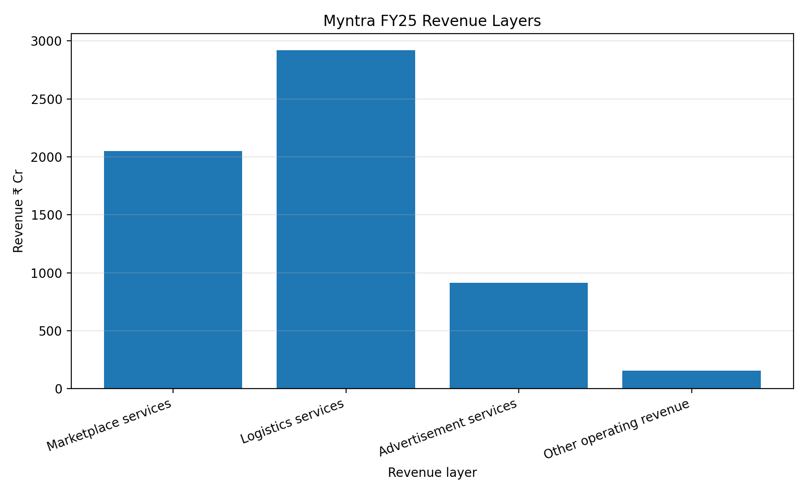

The important point is not that logistics is large. It is that Myntra's marketplace has become a system of monetizable services. Sellers pay for access to demand. Logistics becomes a revenue line. Brands pay for visibility. The customer transaction is only the visible event. The monetization happens around it.

A new-age marketplace cannot be assessed only on commission. Commission is one layer. The stronger model is marketplace fee, logistics or service revenue, seller or brand advertising, and repeat customer contribution together. Without those additional layers, the business survives on thin commission economics while paying modern acquisition costs.

### 2.3 Nykaa Fashion: pressure inside fashion verticals

Nykaa Fashion discloses fashion-specific economics that challenge easy assumptions. In FY26: **GMV ₹4,954 Cr**, **NSV ₹1,447 Cr**, **revenue from operations ₹832 Cr**, **gross profit ₹692 Cr**, **marketing and S&D ₹382 Cr**, **fulfilment ₹162 Cr**, **contribution profit ₹147 Cr**, **EBITDA -₹37 Cr**. [S3]

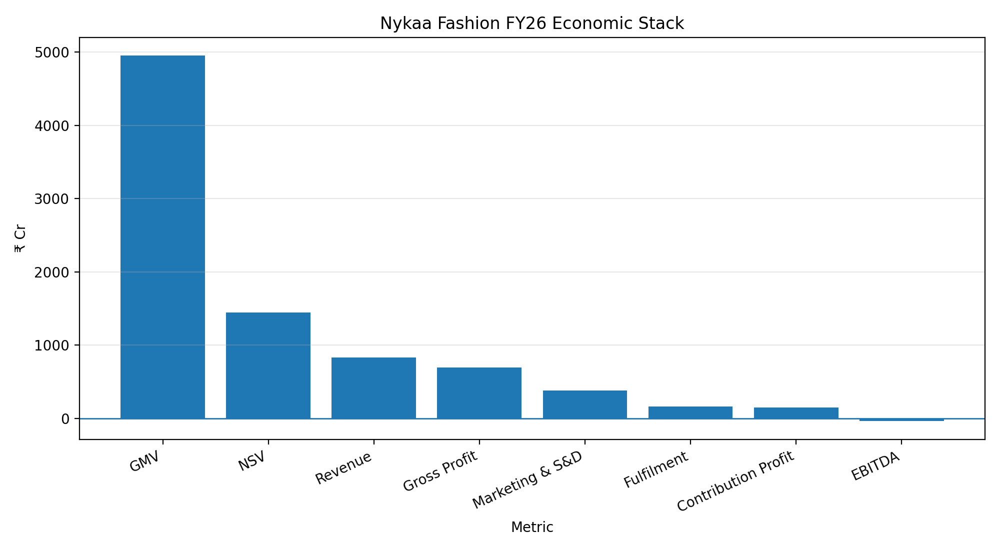

Fashion can look healthy at the gross profit level and still become tight after marketing, fulfilment, and operating costs. Nykaa Fashion had strong gross profit relative to revenue, but the vertical still reported negative EBITDA. The lesson is not that premium positioning fails. The lesson is that fashion's economics improve only when repeat purchase and operating leverage begin to carry more of the load — and neither arrives automatically at scale.

### 2.4 Meesho: the frequency engine

Meesho is not a premium fashion marketplace, but its mechanics are worth examining carefully. In FY26: **264 million annual transacting users**, **2.668 billion placed orders**, **₹41,560 crore NMV**, **10.1 orders per user per year**. [S4]

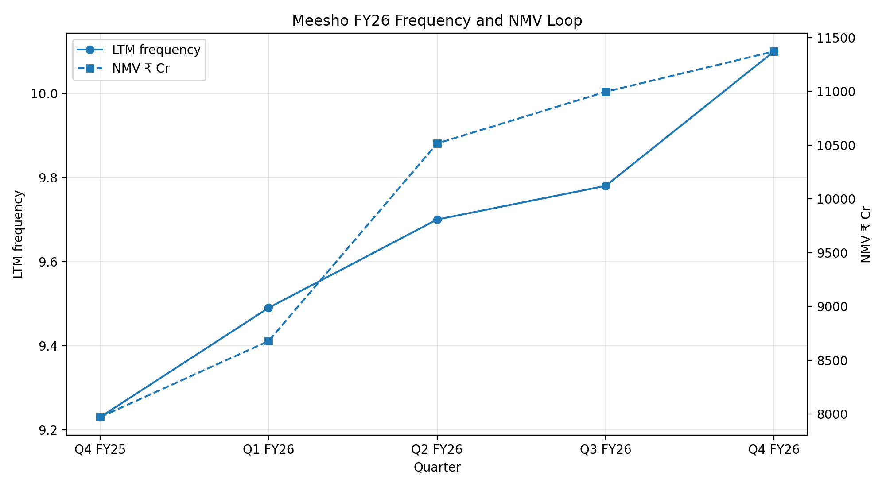

Meesho's model is not directly transferable to a mid-market fashion marketplace. Its price points, customer base, and seller structure are different. But the mechanism is instructive: frequency changes the CAC equation structurally.

If a customer buys once, CAC is recovered from one order. If a customer buys 10 times per year, CAC is spread across a sequence of orders. Repeat purchase is not a retention metric alone. It is a financing mechanism for acquisition.

Meesho reported FY26 marketplace contribution margin of **3.5% of NMV**, with Q4 FY26 recovering to **4.0% of NMV**. The company linked its adjusted EBITDA decline to logistics headwinds, new-user acquisition investment, and AI infrastructure investment. [S4] Even at 10x annual frequency, the acquisition and logistics pressure persists.

### 2.5 Flipkart and Amazon: the retail-media engine

Flipkart Internet's FY25 service revenue: **₹204,933 million operating revenue** including **₹77,506 million marketplace services**, **₹42,245 million logistics services**, and **₹63,170 million advertisement services** (recognized on cost-per-day, clicks, or impressions basis). [S5]

Amazon Seller Services India FY25: **₹301,386 million operating revenue** including **₹173,281 million marketplace services** and **₹83,423 million other marketplace-related services** (primarily advertising, recognized on clicks, impressions, or services rendered). [S6]

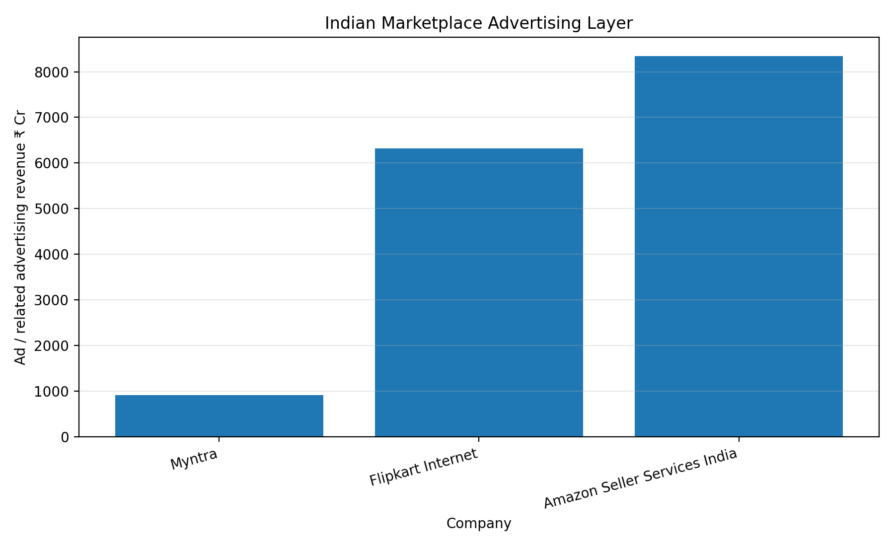

Once traffic is large and high-intent, the marketplace can sell visibility back to sellers and brands. That doesn't just add revenue — it changes the economic character of the platform. It stops being a transaction layer and becomes a media surface.

This advantage arrives late. Advertising becomes valuable only when the platform can prove conversion, intent, and repeat attention. A new marketplace cannot build this layer first.

### 2.6 Reliance and AJIO: the omnichannel engine

Reliance Retail is not a clean digital benchmark for a new marketplace. In FY26: **₹3.70 lakh crore revenue**, **₹27,000 crore EBITDA**, **387 million registered customers across 1.93 billion transactions**, operating through **3,100+ stores**, **1,200+ cities**, and **5,100+ pin codes**. [S7]

AJIO sits inside this machine. Reliance reported **23% YoY increase in average bill value**, expanded option count to **~3 million**, and AJIO Rush reached **600+ cities** with a four-hour delivery promise. Shein India crossed **11 million app installs** with about **1,000 new option additions per day**. [S7]

The mechanism is ecosystem leverage: stores, supply chain, customer base, brand relationships, and physical infrastructure reduce the trust and fulfilment burden that a standalone startup must solve from zero. AJIO is a competitor, but not a comparable benchmark. A new marketplace cannot replicate Reliance's cost structure unless it also has Reliance's distribution base.

### 2.7 TMRW: the brand-house engine

TMRW, inside ABFRL, takes a different route: own or back digital-first fashion brands rather than operate a marketplace. In FY26: ABFRL consolidated revenue **₹8,177 Cr**, TMRW revenue **₹872 Cr** (up **34% YoY**), EBITDA **-₹207 Cr**, margin **-23.8%**. TMRW's FY26 revenue including WROGN was about **₹1,100 Cr**. [S8]

Owned or controlled brands improve margin, differentiation, and pricing control. But they introduce inventory risk, creative risk, and brand-building cost. A marketplace can blame weak supply on sellers. A brand house cannot. It owns more upside, and more mistakes.

For a new-age marketplace, private labels and exclusive drops may eventually be necessary to raise contribution. Pushed too early, they convert a marketplace problem into an inventory problem.

### 2.8 Trent and Zudio: the owned-retail engine

Trent is not a marketplace comp. It is the Indian owned-retail benchmark. In Q4 FY26: **₹4,937 Cr revenue from operations**, **1,286 stores**, **321 cities**, **17.70 million sq. ft. retail area**, including **300 Westside stores**, **963 Zudio stores**. [S9]

Trent does not need marketplace liquidity. It controls supply, stores, pricing, merchandising, and offline discovery. Its engine is owned supply plus store density. Offline footfall and brand habit reduce dependence on digital paid acquisition — but at the cost of fixed-cost intensity, store execution, working capital, and inventory discipline.

Trent is useful as a reminder that fashion demand can be built through physical distribution. A digital marketplace must compensate for the absence of stores by building trust, content, and repeat behavior inside an app alone.

### 2.9 The map

| Company | Dominant engine | What it teaches |
|---|---|---|
| **Myntra** | Marketplace + logistics + retail media | Mature fashion marketplaces monetize services around the transaction |
| **Nykaa Fashion** | Brand trust + curated vertical | Fashion can stay margin-tight even after scale |
| **Meesho** | Frequency + value marketplace | Repeat transactions spread acquisition cost |
| **Flipkart Internet** | Marketplace + retail media | Large marketplaces monetize seller demand through ads |
| **Amazon Seller Services India** | Marketplace + retail media | Advertising becomes powerful when traffic is high-intent |
| **Reliance Retail / AJIO** | Omnichannel distribution | Stores, supply, and customer base reduce standalone digital burden |
| **TMRW / ABFRL** | Digital-first brand ownership | Owned brands improve control but add inventory and brand risk |
| **Trent / Zudio / Westside** | Owned retail + price architecture | Owned supply and store density can substitute for marketplace liquidity |

Indian fashion commerce is not one race. It is several races happening on the same shopping surface. A new marketplace cannot claim to be "like Myntra." It has to decide which engine it is building first — and in what order.

Retail media cannot be the first engine because there is no valuable ad surface without traffic. Repeat purchase cannot be assumed before customers trust quality and returns. Owned supply cannot scale carelessly without inventory risk. Marketplace liquidity cannot be manufactured cheaply if CAC is already high.

CAC is not an isolated number. It is the price the company pays for not yet having one of these engines working.

---

## 3. CAC Is Not a Number. It Is a Symptom

After mapping the Indian fashion field, the acquisition problem becomes structurally clear. CAC is not the price of an ad click. It is the price a company pays for missing trust, habit, supply quality, or retail-media leverage.

A mature marketplace does not acquire every order from zero. It has accumulated state: saved users, repeat visits, known brands, seller-funded promotions, app notifications, wallet balances, wishlists, reviews, returns history, and search behavior. A new marketplace has almost none of this. That absence shows up as CAC.

This matters for how CAC should be read. Weak assortment raises CAC because users don't find enough to convert. Weak trust raises CAC because more persuasion is required per transaction. Weak fit and returns raise CAC because customers hesitate. Weak repeat purchase raises CAC because the same demand must be purchased again every month. CAC absorbs all of these failures simultaneously.

Public filings do not disclose company-level CAC for Myntra, Nykaa Fashion, Meesho, Flipkart, Amazon India, AJIO, TMRW, or Trent. Any report claiming exact CAC from public data is estimating, not reporting. What can be verified is the pressure around acquisition: marketing expense, growth spend, ad monetization, repeat frequency, and the cost of replacing habit with paid traffic.

### 3.1 The visible pressure from public filings

Myntra spent **₹21,053 million** on advertising and promotional expenses in FY25, against **₹60,427 million** in operating revenue — roughly **34.8%** of operating revenue. The same filing shows Myntra earned **₹9,145 million** from advertisement services. [S2] The platform is simultaneously buying demand and selling visibility into that demand.

Nykaa Fashion gives a cleaner fashion-specific view. In FY26: Fashion NSV **₹1,447 Cr**, marketing and S&D **₹382 Cr** (**26.4% of NSV**), fulfilment **₹162 Cr**, contribution profit **₹147 Cr**, EBITDA **-₹37 Cr**. [S3]

Meesho signals a different dynamic. Its FY26 growth spend (advertisement and sales promotion) increased to **₹990 Cr** (**2.4% of NMV**), directed at acquiring and activating new users, specifically new-to-ecommerce users. The company states it invests aggressively in new-user acquisition where payback works, and slows down where it does not. [S4]

These three numbers are not directly comparable — Myntra uses operating revenue as base, Nykaa Fashion uses fashion NSV, Meesho uses NMV. But the pattern holds across all three: mature fashion marketplaces, curated fashion verticals, and frequency-led marketplaces all pay for demand before that demand becomes habit.

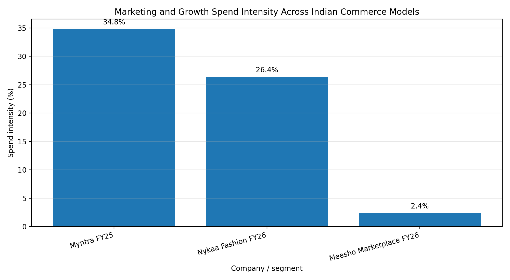

### 3.2 Why CAC rises before it falls — and the mechanism behind it

Early CAC is high because early customers are being asked to trust an incomplete system. The catalogue is smaller. Reviews are thinner. Delivery reliability is unproven. Returns are uncertain. Brand recall is weak. The customer has no stored preference.

The first phase of marketing is not acquiring buyers. It is buying evidence. The sequence: first order, delivery experience, return or keep decision, trust update, repeat probability.

If that loop works, CAC falls — because the second and third orders do not need to be purchased with the same intensity. If that loop fails, marketing spend only rents attention. The business grows orders but not memory.

A campaign creates a spike. A marketplace needs the spike to leave residue. That residue is saved addresses, app installs, wishlists, reviews, size confidence, brand memory, creator trust, and repeat visits. Without residue, CAC does not fall. It compounds.

### 3.3 The target scale exposes the math

At the target scale used in this report — **150,000 monthly orders** — the critical variable is not only CAC. It is the share of orders coming from newly acquired customers.

At **60%** new-customer share, acquisition pressure is severe. At **35%**, the model becomes more realistic. At **25%**, the business starts resembling a system with genuine repeat behavior.

Monthly acquisition spend is:

$$\text{Monthly acquisition spend} = \text{monthly orders} \times \text{new customer share} \times \text{CAC}$$

At **150,000 monthly orders**:

| CAC | New customer share 25% | New customer share 35% | New customer share 45% | New customer share 60% |
|---:|---:|---:|---:|---:|
| ₹150 | ₹0.56 Cr | ₹0.79 Cr | ₹1.01 Cr | ₹1.35 Cr |
| ₹250 | ₹0.94 Cr | ₹1.31 Cr | ₹1.69 Cr | ₹2.25 Cr |
| ₹350 | ₹1.31 Cr | ₹1.84 Cr | ₹2.36 Cr | ₹3.15 Cr |
| ₹500 | ₹1.88 Cr | ₹2.63 Cr | ₹3.38 Cr | ₹4.50 Cr |
| ₹700 | ₹2.63 Cr | ₹3.68 Cr | ₹4.73 Cr | ₹6.30 Cr |

The same CAC is manageable or fatal depending on how many orders are still being purchased from outside. CAC cannot be evaluated in isolation from repeat share.

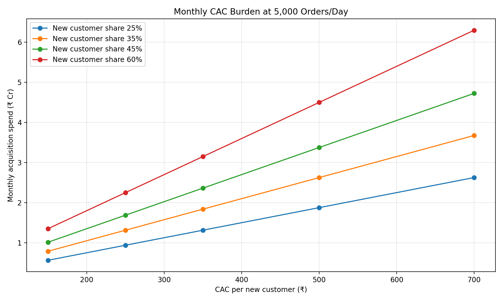

### 3.4 Post-view conversion: useful, but dangerous if trusted blindly

Post-view conversion matters because fashion is visual. A user may see a dress, sneaker, or creator reel — not click immediately — and return later to buy. Click-based attribution understates the ad's influence in that case.

Google defines view-through conversions as conversions occurring after an ad impression when the user does not interact with the ad and later converts, and notes that a longer view-through window usually increases the number of view-through conversions recorded. [S10]

That second point is the warning. A longer attribution window can make marketing look better without producing more incremental customers.

The relevant number is not reported post-view conversion. It is incremental post-view conversion. The IAB/MRC retail media guidelines define incrementality as the causal impact of marketing isolated from other business factors, and recommend test-control approaches including randomized control trials, synthetic matching, and matched-market methods. [S11]

Those same guidelines set viewability thresholds: a display ad is viewable when at least **50% of pixels** are visible for at least **one continuous second**; for video, at least **two continuous seconds**. Viewable impressions are required for MRC-compliant attribution of outcomes to ad exposures. [S11]

The model should not ask how many impressions were served. It should ask: how many were viewable, how many conversions were incremental, and how many of those customers repeated.

### 3.5 The post-view CAC formula

$$\text{Incremental CAC} = \frac{\text{CPM}}{1000 \times \text{viewability rate} \times \text{post-view conversion rate} \times \text{incrementality factor}}$$

| Variable | Meaning |
|---|---|
| **CPM** | Cost of 1,000 impressions |
| **Viewability rate** | Share of impressions that were actually viewable |
| **Post-view conversion rate** | Share of viewable impressions that later converted |
| **Incrementality factor** | Share of those conversions actually caused by the ad |

This is a constraint equation, not a prediction. Using **70% viewability**, **60% incrementality**, and CPM cases of ₹50, ₹80, and ₹120, post-view conversion must reach roughly **0.05%–0.08% from viewable impressions** for CAC to stay in a tolerable range.

At **₹80 CPM**:

| Post-view conversion rate | Incremental CAC |
|---:|---:|
| 0.02% | ₹952 |
| 0.05% | ₹381 |
| 0.08% | ₹238 |
| 0.10% | ₹190 |

Below 0.03%, post-view advertising becomes too expensive for a new fashion marketplace unless the acquired customer has unusually high future contribution.

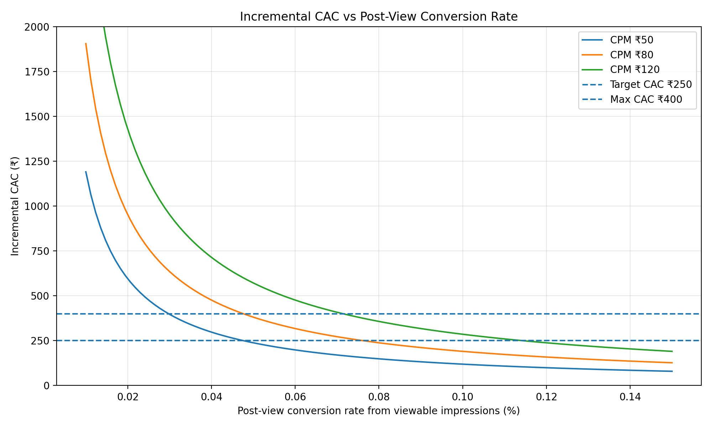

### 3.6 CAC is paid in cash, but recovered through behavior

CAC is not recovered by attribution. It is recovered through what the customer does after acquisition.

A weak company treats CAC as the cost to get an order. A stronger company treats CAC as the cost to create a customer state: installed app, trusted size, saved address, preferred brand, known return path, and future purchase probability.

That is why high CAC is not automatically bad. High CAC is bad when it buys a low-memory customer.

| Acquisition outcome | Business meaning |
|---|---|
| One discounted order | Paid transaction |
| App install with no repeat | Weak memory |
| First order plus repeat | Recoverable CAC |
| Repeat customer with low returns | Contribution asset |
| Repeat customer who influences others | CAC reducer |

CAC should be measured in relation to future contribution, not in isolation.

### 3.7 The early test

For a new Indian fashion marketplace, the early target should not be to maximize orders. It should be to lower CAC while increasing repeat share.

A company can increase orders by spending more. It can reduce CAC temporarily by cutting spend and accepting slower growth. Neither of these proves anything about marketplace health.

The useful test is whether all three move together: orders rise, CAC falls, and repeat share rises.

If orders rise while CAC rises, the company is buying volume. If CAC falls while orders stall, the company may be under-scaling. If repeat share rises while CAC falls, the system is beginning to retain demand. That is the first real signal that a marketplace engine is forming.

---

## 4. The Customer Has to Carry the Acquisition Cost

CAC is paid before the customer has proven anything. Contribution arrives later, and only if the customer keeps the product, avoids excessive returns, and buys again without being reacquired at the same cost. This timing gap is one of the main structural risks in fashion marketplaces.

A first order can be produced through many channels: a discount, a creator post, a performance ad, a sale event, a referral credit, or a post-view ad exposure. None of these prove customer value. They prove only that the platform could create a transaction under a particular incentive structure.

This is why the two PVCs must remain separate.

| Term | Meaning | What it tests |
|---|---|---|
| **PVC-Ad** | Post-view conversion | Whether ad exposure contributed to conversion |
| **PVC-LTV** | Present value of contribution | Whether the acquired customer is economically worth the CAC |

Post-view conversion is an attribution question. PVC-LTV is an economics question. Mixing the two produces false confidence. A campaign can show conversions while the customers it acquires fail to generate enough contribution to repay acquisition cost.

The complete chain is longer than any ad dashboard shows: ad exposure, first order, delivery experience, keep or return decision, repeat purchase, and contribution recovery. The marketplace only becomes healthier if this chain improves over time. If the chain breaks after the first order, CAC is not an investment. It is the price of rented demand.

### 4.1 The first constraint

The minimum condition is:

$$\text{PVC-LTV} > \text{CAC}$$

But this condition is too weak for an early fashion marketplace. Data is noisy, returns are delayed, attribution can over-credit campaigns, discounts distort demand, and repeat behavior is uncertain. A small positive spread between PVC-LTV and CAC can disappear once operational leakage is properly measured.

For this reason, the model uses a stricter hurdle:

$$\frac{\text{PVC-LTV}}{\text{CAC}} \geq 3$$

This is not a universal rule. It is a margin of safety. The earlier the marketplace, the more uncertain the cohort data — and the more margin of safety the model requires.

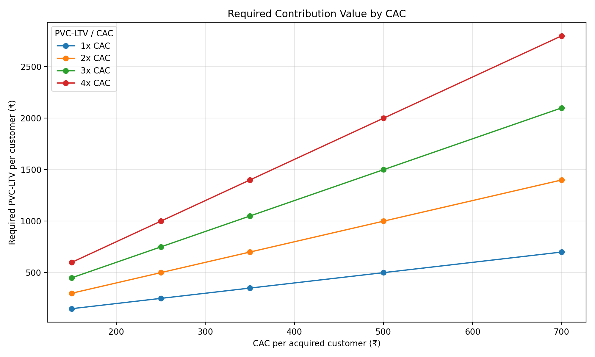

| CAC | PVC-LTV needed at 1x | PVC-LTV needed at 2x | PVC-LTV needed at 3x | PVC-LTV needed at 4x |
|---:|---:|---:|---:|---:|
| ₹150 | ₹150 | ₹300 | ₹450 | ₹600 |
| ₹250 | ₹250 | ₹500 | ₹750 | ₹1,000 |
| ₹350 | ₹350 | ₹700 | ₹1,050 | ₹1,400 |
| ₹500 | ₹500 | ₹1,000 | ₹1,500 | ₹2,000 |
| ₹700 | ₹700 | ₹1,400 | ₹2,100 | ₹2,800 |

A ₹500 CAC under a 3x hurdle requires ₹1,500 of present contribution value from one customer. In fashion, that requires enough retained orders, enough margin per order, controlled returns, and limited reacquisition cost. If the customer buys once and returns part of the order, the required contribution pool rarely appears.

### 4.2 The second constraint

CAC is recovered through contribution per order:

$$\text{Orders needed to recover CAC} = \frac{\text{CAC}}{\text{contribution per order}}$$

This equation removes the distraction of GMV. A high-GMV order is not necessarily a high-contribution order. The relevant figure is what remains after platform-funded discounts, fulfilment, returns, payments, support, and leakage.

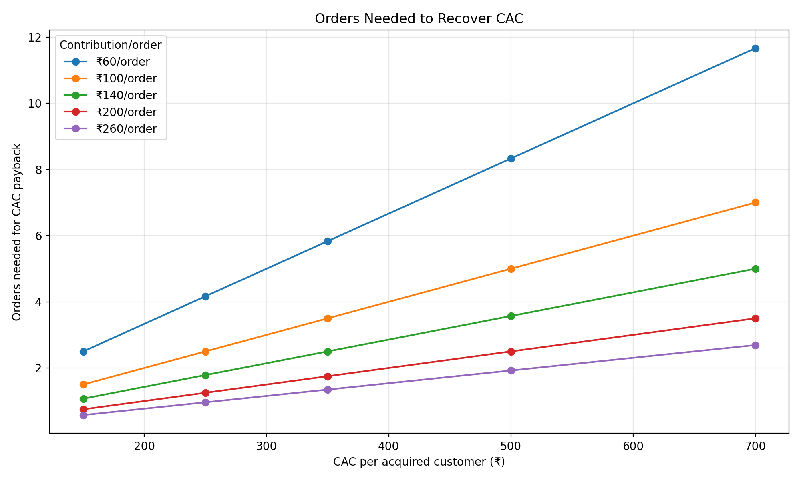

| CAC | ₹60 contribution/order | ₹100 contribution/order | ₹140 contribution/order | ₹200 contribution/order | ₹260 contribution/order |
|---:|---:|---:|---:|---:|---:|
| ₹150 | 2.5 orders | 1.5 orders | 1.1 orders | 0.8 orders | 0.6 orders |
| ₹250 | 4.2 orders | 2.5 orders | 1.8 orders | 1.3 orders | 1.0 order |
| ₹350 | 5.8 orders | 3.5 orders | 2.5 orders | 1.8 orders | 1.3 orders |
| ₹500 | 8.3 orders | 5.0 orders | 3.6 orders | 2.5 orders | 1.9 orders |
| ₹700 | 11.7 orders | 7.0 orders | 5.0 orders | 3.5 orders | 2.7 orders |

When contribution per order is ₹60, even a ₹250 CAC requires more than four contribution-bearing orders to recover acquisition cost. When contribution per order is ₹140, the same CAC needs fewer than two orders. When contribution per order is ₹260, the first order can nearly recover acquisition cost. CAC is not independently good or bad. Its quality depends entirely on the contribution depth behind each retained order.

### 4.3 What contribution means in this model

Contribution is not GMV. It is not platform revenue. It is the cash-like value left after variable leakage.

For a Myntra-like marketplace:

$$\text{Contribution/order} = \text{platform revenue/order} - \text{variable cost/order}$$

Platform revenue may include: marketplace commission, logistics or service revenue, seller or brand advertising revenue, and platform fees.

Variable cost may include: forward delivery, reverse logistics, payment gateway, customer support, refund leakage, platform-funded discounts, packaging, and fraud or abuse.

Myntra's FY25 filings support this structure: service revenue splits across marketplace services, logistics services, and advertisement services, with no product sales revenue. [S2]

Nykaa Fashion shows why this separation matters. In FY26, it had gross profit of **₹692 Cr** but after marketing, S&D, fulfilment, and other operating costs, reported **EBITDA of -₹37 Cr**. [S3] The implication is not that a new marketplace will follow Nykaa's exact economics. The implication is narrower: fashion can look viable before acquisition and cost-to-serve are fully loaded, and much weaker after.

### 4.4 The third constraint

PVC-LTV depends on repeat depth and contribution per order:

$$\text{PVC-LTV} = \text{contribution per order} \times \text{contribution-bearing orders per customer} \times \text{present-value adjustment}$$

The present-value adjustment accounts for delay, uncertainty, and cohort decay. This model uses a **12% haircut**, meaning future contribution is valued at 88% of nominal. This is an internal model assumption, not a reported company figure.

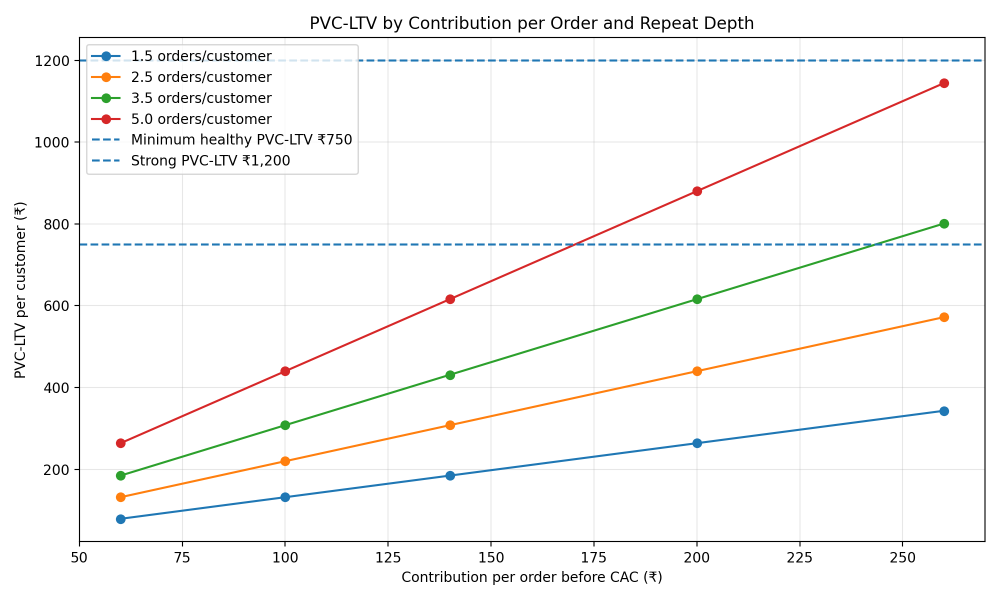

| Contribution/order | 1.5 orders/customer | 2.5 orders/customer | 3.5 orders/customer | 5.0 orders/customer |
|---:|---:|---:|---:|---:|
| ₹60 | ₹79 | ₹132 | ₹185 | ₹264 |
| ₹100 | ₹132 | ₹220 | ₹308 | ₹440 |
| ₹140 | ₹185 | ₹308 | ₹431 | ₹616 |
| ₹200 | ₹264 | ₹440 | ₹616 | ₹880 |
| ₹260 | ₹343 | ₹572 | ₹801 | ₹1,144 |

The weak zone is easy to spot. Low contribution per order and low repeat depth cannot support meaningful CAC. The model may still produce orders, but those orders do not create enough customer value.

A customer generating ₹140 contribution per order across 3.5 contribution-bearing orders creates about ₹431 of PVC-LTV after the haircut. That does not support a ₹250 CAC at 3x (which requires ₹750). The marketplace must improve at least one of three variables: lower CAC, higher contribution per order, or higher repeat depth. There is no growth strategy that escapes this constraint.

### 4.5 The CAC ceiling

At a 3x hurdle:

$$\text{CAC ceiling} = \frac{\text{PVC-LTV}}{3}$$

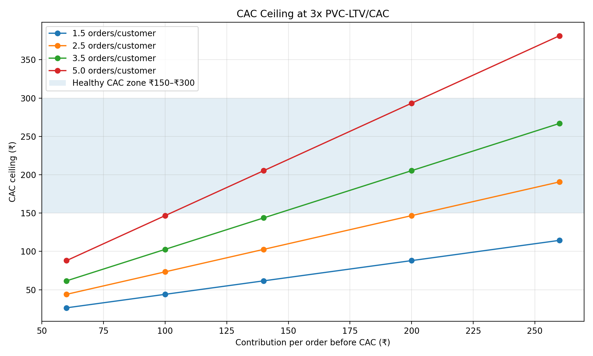

| Customer value condition | CAC interpretation |
|---|---|
| PVC-LTV below ₹450 | Paid scaling is fragile |
| PVC-LTV around ₹750 | ₹250 CAC becomes acceptable at 3x |
| PVC-LTV around ₹1,200 | ₹400 CAC becomes acceptable at 3x |
| PVC-LTV above ₹1,500 | ₹500 CAC can be justified, but only with strong cohort evidence |

Early fashion marketplaces have a narrow CAC window because repeat depth is low. If repeat depth is low, the CAC ceiling stays low even when contribution per order improves. If repeat depth improves, the same business can afford more acquisition without weakening the model.

A low-CAC channel can still be poor if it brings low-repeat customers. A higher-CAC channel can be rational if it brings customers with higher retained contribution and repeat depth. The media dashboard does not reveal this difference.

### 4.6 Why the order mix matters

At **150,000 monthly orders**, the order count itself reveals nothing about marketplace health. The diagnostic question is how much of that volume still depends on newly acquired customers.

At 60% new-customer share, the company is replacing demand every month. At 35%, repeat behavior is beginning to carry the system. At 25%, the marketplace has started accumulating memory.

The same order milestone can describe two entirely different systems. In a weak system, orders rise, new-customer share stays high, CAC stays high, and contribution is consumed. In a stronger system, orders rise, new-customer share falls, repeat share rises, CAC declines, and contribution accumulates.

### 4.7 Viability thresholds

These are not predictions. They are the conditions the model requires to remain internally coherent.

| Metric | Minimum workable range | Stronger range |
|---|---:|---:|
| Blended CAC | ₹150–₹250 | Below ₹200 |
| Paid CAC | ₹200–₹300 | Below ₹250 |
| PVC-LTV/customer | ₹750–₹1,200 | ₹1,200+ |
| PVC-LTV / CAC | 3x | 4x+ |
| Contribution/order before CAC | ₹120+ | ₹200+ |
| Contribution-bearing orders/customer | 3+ | 4–5+ |
| New customer share of orders | 30–40% | 25–30% |
| Repeat / CRM / direct share | 60%+ | 70%+ |

If these conditions are not met, the order target can still be reached. The system remains acquisition-dependent, and the company is scaling transactions before proving customer value.

### 4.8 The mechanism

CAC buys an initial customer state: known size, saved address, trusted return path, wishlist, app habit, brand preference, and repeat probability. The value of CAC depends on how much of that state survives the first transaction.

If the customer does not remember the platform, trust the delivery, keep the product, or return without being paid again, the acquisition cost has produced very little durable value.

CAC becomes less damaging only when it creates memory inside the marketplace. That memory can appear as repeat purchase, lower return anxiety, better size confidence, direct app opens, seller-funded visibility, or reduced dependence on discounts. Without memory, every order remains a fresh acquisition problem. The customer must outlive the ad.

---

## 5. Growth Only Matters When Dependence Falls

A marketplace does not become stronger merely because order volume rises. Order growth can be produced by paid media, discounts, creator pushes, and launch campaigns. The more useful test is whether the platform becomes less dependent on external acquisition as that growth happens.

This section treats the target as **150,000 monthly orders**. The monthly frame is more useful than a daily milestone because acquisition spend, cohort behavior, repeat purchase, and contribution recovery are all easier to observe over monthly cycles.

The core question is not whether the marketplace can reach that volume. It is whether the composition of that volume improves. A healthy ramp should show four movements simultaneously: orders rise, paid CAC falls, new-customer share declines, and repeat-driven orders become a larger share of the system.

If order volume rises while new-customer dependence stays high, the company has not built a marketplace engine. It has only increased the rate at which it must replace demand.

### 5.1 Three ways to reach the same order volume

| Path | Time to 150,000 monthly orders | What the path assumes | Main analytical risk |
|---|---:|---|---|
| **Aggressive** | 6 months | Faster paid acquisition, stronger launch inventory, higher discount tolerance | Scale arrives before cohort quality is understood |
| **Base** | 10 months | Paid acquisition declines as creator, CRM, and repeat loops improve | The model requires month-by-month operating improvement |
| **Controlled** | 14 months | Slower expansion, more cohort data, tighter logistics discipline | The company may underuse real early demand |

The aggressive path is not structurally wrong. It is simply less informative. Fashion cohorts need time to reveal whether customers keep products, return excessively, buy again, respond to CRM, and trust the platform after the first transaction. The base path gives enough time to observe early customer behavior while forcing meaningful scale.

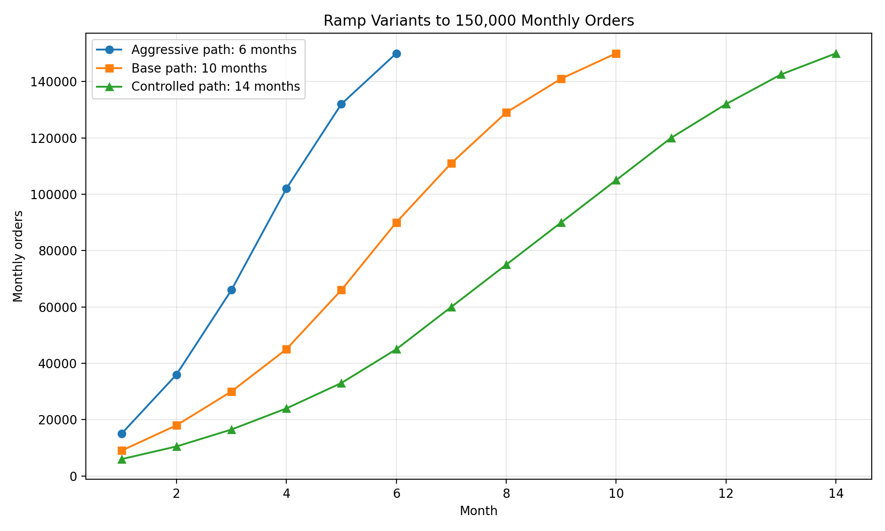

### 5.2 The base path is not just an order ramp

The base path moves from **9,000 monthly orders** in Month 1 to **150,000 monthly orders** in Month 10.

The order ramp is only the visible layer. The critical layer is the decline in paid dependence. By Month 10, the model requires new-customer share to fall to **35%**, paid share of new customers to fall to **40%**, and paid CAC to fall to **₹250**.

| Month | Monthly orders | New customer share | Paid share of new customers | Paid CAC | Paid acquisition spend |
|---:|---:|---:|---:|---:|---:|
| 1 | 9,000 | 85% | 75% | ₹520 | ₹0.30 Cr |
| 2 | 18,000 | 80% | 70% | ₹480 | ₹0.48 Cr |
| 3 | 30,000 | 75% | 65% | ₹430 | ₹0.63 Cr |
| 4 | 45,000 | 68% | 60% | ₹380 | ₹0.70 Cr |
| 5 | 66,000 | 60% | 55% | ₹340 | ₹0.74 Cr |
| 6 | 90,000 | 52% | 50% | ₹310 | ₹0.73 Cr |
| 7 | 111,000 | 46% | 47% | ₹290 | ₹0.70 Cr |
| 8 | 129,000 | 42% | 44% | ₹270 | ₹0.64 Cr |
| 9 | 141,000 | 38% | 42% | ₹260 | ₹0.59 Cr |
| 10 | 150,000 | 35% | 40% | ₹250 | ₹0.52 Cr |

The model becomes healthier only if paid acquisition spend peaks before the order target is reached. If paid spend keeps rising in proportion to orders, the business is not compounding. It is renting a larger volume of demand.

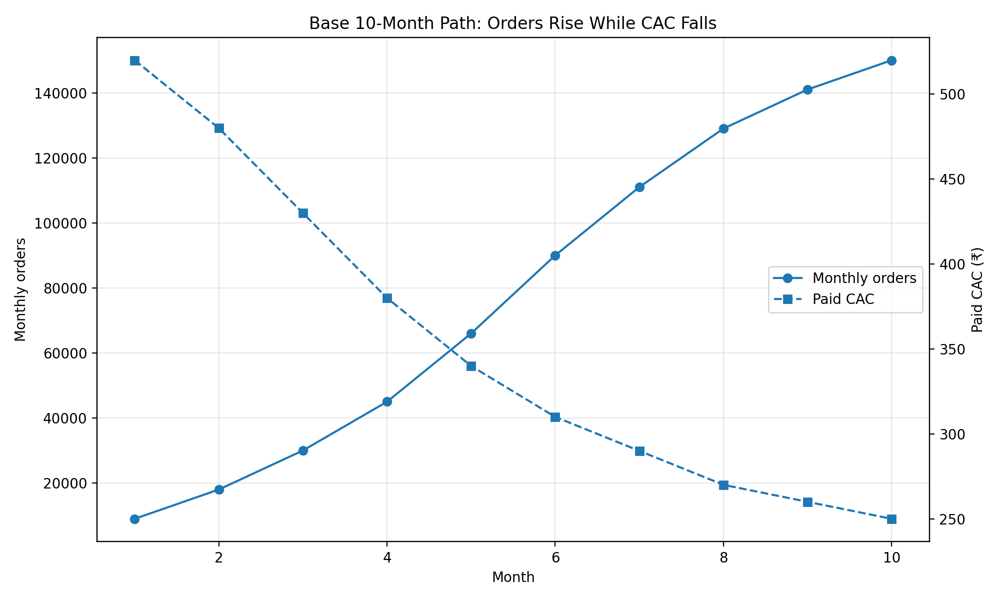

### 5.3 Paid acquisition should peak before the marketplace reaches scale

Monthly paid acquisition burden is:

$$\text{Monthly paid acquisition spend} = \text{monthly orders} \times \text{new-customer share} \times \text{paid share of new customers} \times \text{paid CAC}$$

This equation shows why order growth can mislead. A company grows orders while reducing paid acquisition burden only if repeat behavior improves and CAC falls. Without those two changes, the marketplace remains dependent on outside demand.

In the base path, direct paid acquisition spend totals roughly **₹6 crore** over ten months. This excludes creator payments, production, referral incentives, launch offers, CRM tooling, brand activity, and marketing operations.

Isolating direct paid acquisition is methodologically useful. It is the cleanest place to observe whether the company is buying durable customers or only purchasing monthly transaction volume.

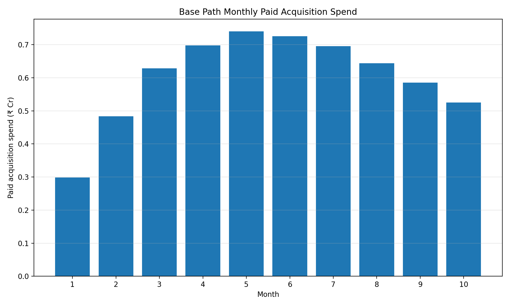

### 5.4 The channel mix must shift — not as preference, but as economic requirement

Early orders can come from paid performance. Later orders cannot depend on it at the same rate. The model assumes a shift from paid acquisition toward creator, affiliate, CRM, and repeat behavior.

| Channel group | Month 1 | Month 10 |
|---|---:|---:|
| Paid performance | 60% | 18% |
| Creator / affiliate | 20% | 30% |
| CRM / repeat | 5% | 42% |
| Organic / direct | 15% | 10% |

The key shift is the rise of CRM and repeat orders. If CRM and repeat do not become the largest bucket by Month 10, the marketplace has not converted acquisition into customer memory. The decline in organic/direct share is a modelling choice — behavior that initially appears as broad organic demand should become measurable repeat behavior as the platform matures.

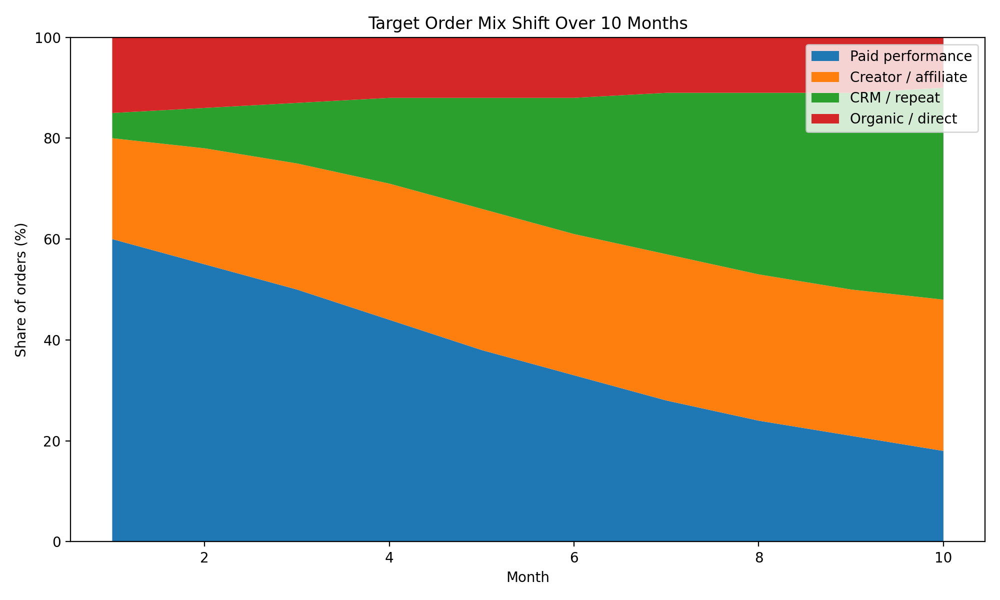

### 5.5 Contribution determines whether the ramp creates capacity

The same order ramp produces different economic outcomes depending on contribution per order.

| Contribution per order | What it implies |
|---:|---|
| ₹100 | The system has thin contribution and limited room after acquisition |
| ₹140 | The model becomes workable only if CAC declines on schedule |
| ₹200 | The ramp creates more room for fixed costs, operating leakage, and reinvestment |

Two marketplaces can both reach the same monthly order count, but one may generate enough contribution to absorb CAC while the other remains dependent on fresh capital.

At lower contribution per order, paid acquisition consumes most of the system's output. At higher contribution per order, the same ramp begins to create operating capacity. The difference determines whether growth produces a stronger business or a larger loss structure.

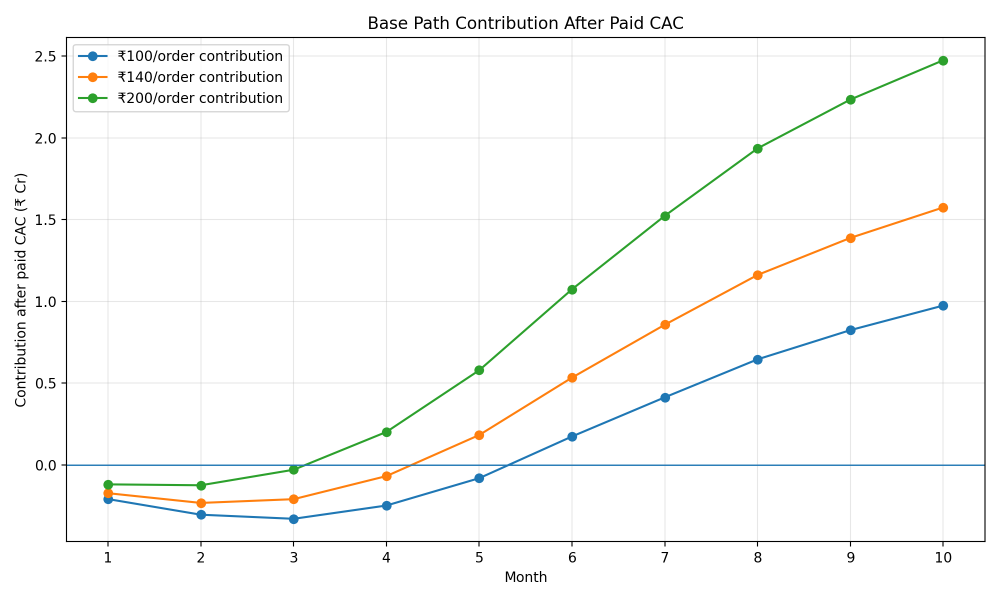

### 5.6 The ramp has four distinct bottlenecks

The ten-month path should not be read as one repeated growth tactic. Each phase tests a different part of the system.

| Phase | Main bottleneck | What must be learned |
|---|---|---|
| Months 1–2 | Demand evidence | Whether customers respond without excessive artificial incentives |
| Months 3–5 | Channel quality | Which channels produce retained contribution, not just cheap first orders |
| Months 6–8 | Repeat behavior | Whether early customers return without full reacquisition |
| Months 9–10 | Discipline at scale | Whether weak channels, categories, and geographies can be rejected despite order pressure |

In the first phase, the risk is mistaking novelty for demand. Launch curiosity creates orders that may not repeat. Heavy discounts distort the signal so much the company learns very little from early volume.

In the second phase, the risk is optimizing for reported CAC instead of retained contribution. A low-CAC channel can be weak if it attracts high-return, low-repeat customers. The relevant comparison is channel CAC against channel-level PVC-LTV.

In the third phase, the marketplace has to show memory: repeat purchases, CRM response, saved preferences, size confidence, direct app opens, and lower dependence on cold paid traffic.

In the fourth phase, the company must reject low-quality scale. A weak channel should not be kept only because it produces orders. A high-return category should not be expanded only to improve GMV.

### 5.7 The actual test of the ramp

By Month 10, the target condition is:

| Metric | Target |
|---|---:|
| Monthly orders | 150,000 |
| New-customer share | 35% or lower |
| Paid CAC | ₹250 or lower |
| Repeat / CRM / direct order share | 60%+ |

This does not prove long-term durability. It proves only that the first layer of marketplace memory exists.

### 5.8 The feedback loop

The healthy loop:

$$\text{better cohort evidence} \rightarrow \text{better channel allocation} \rightarrow \text{lower CAC} \rightarrow \text{more retained customers} \rightarrow \text{higher repeat share} \rightarrow \text{more contribution available for growth}$$

The weak loop:

$$\text{weak repeat} \rightarrow \text{more paid acquisition required} \rightarrow \text{higher CAC pressure} \rightarrow \text{more discounting} \rightarrow \text{lower contribution} \rightarrow \text{greater dependence on paid growth}$$

Both loops can produce order growth for some time. Only the first creates a marketplace whose economics improve with scale. The ramp is not evidence by itself. The evidence is whether dependency falls while the ramp happens.

---

## 6. Marketing Has to Become an Operating System

Section 5 showed the ramp condition: order volume must rise while dependence on paid acquisition falls. Section 6 asks how that can happen.

The answer is not a single channel. A new fashion marketplace cannot fix CAC by choosing between Meta, Google, influencers, founders, creators, or CRM. The channel is not the unit of analysis. The unit of analysis is whether the channel creates marketplace memory.

Marketplace memory means the customer becomes easier to convert the next time. It may appear as saved sizes, repeat app opens, wishlist behavior, creator trust, category confidence, CRM response, lower return anxiety, or direct search for the platform. A marketing system that does not create memory only rents attention. It may produce orders, but it does not reduce future acquisition pressure.

### 6.1 The channel is only useful if it changes the next order

A paid ad can create a first order. A creator can create trust. A founder can create narrative. A brand campaign can create familiarity. CRM can reactivate an existing customer. These are not interchangeable.

The mistake is comparing channels only by reported CAC. A lower-CAC channel can still be weak if it brings customers who buy only with discounts, return more products, or do not repeat. A higher-CAC channel can be rational if it creates customers with higher retained contribution.

The correct metric is:

$$\text{Effective CAC} = \frac{\text{media spend + creator payouts + discounts + production + tools}}{\text{new retained customers}}$$

The denominator matters. A customer who places an order and returns it fully is not the same as a customer who keeps the product and buys again.

### 6.2 Channel roles in a fashion marketplace

The acquisition system should be built around channel functions, not channel names.

| Channel type | What it can solve | What it cannot solve alone |
|---|---|---|
| **Paid performance** | Fast demand testing and measurable acquisition | Trust, habit, and long-term differentiation |
| **Influencer / affiliate** | Borrowed trust and product discovery | Cohort quality unless attribution and returns are measured |
| **Founder-led content** | Narrative, credibility, and category point of view | Scale if the founder is the only demand source |
| **Brand-led content** | Familiarity and trust over time | Fast CAC payback in early stages |
| **SEO / owned content** | Compounding intent capture | Immediate order volume |
| **CRM / repeat** | Lower-cost reactivation and habit formation | New demand creation from zero |
| **Retail media / seller-funded promotions** | Monetization of traffic | Early-stage acquisition before meaningful traffic exists |

Paid performance should be used as a testing layer, not a permanent foundation. The foundation has to move toward repeat, creator trust, owned content, and CRM.

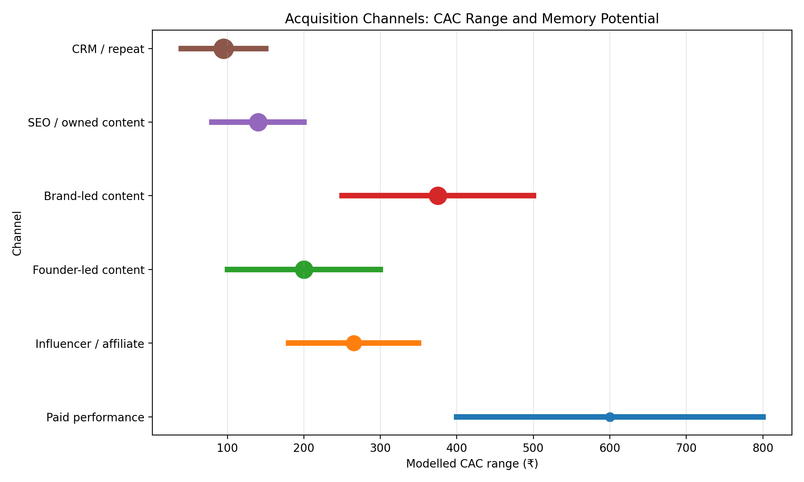

### 6.3 Creator-led commerce matters because fashion is not purely search-led

Fashion demand is visual and socially mediated. A customer often does not begin with a precise query. The customer may begin with an occasion, a person, a look, a price band, a body type, or a trend. Creator-led acquisition can compress the trust gap a cold ad has to overcome. A creator does not only show the product. The creator shows fit, context, use case, social proof, and taste.

Myntra's social-commerce positioning, reported through marketing-industry sources, shows incumbents moving in this direction: the Ultimate Glam Clan had **3.5 million shopper-creators**, social commerce was described as contributing **10% of revenue**, one in five users engaged with social-commerce content, and the off-platform affiliate network reportedly generated **9 billion monthly impressions**. [S14]

This is not audited financial disclosure and should be treated as directional evidence, not model input. What is useful is not the size of the numbers but the direction: Myntra is not treating creators as an awareness layer outside commerce. It is trying to bring content, discovery, affiliate distribution, and conversion closer to the transaction.

For a new marketplace, the lesson is narrow. Creator-led marketing is useful only if it produces retained customers. Impressions without kept orders and repeat behavior do not matter.

### 6.4 Founder-led marketing has a different function

Founder-led marketing should not be confused with influencer marketing.

An influencer borrows trust from an audience. A founder-led system tries to create trust in the marketplace itself. The founder becomes an explanation layer for why the marketplace exists, what it curates, what it rejects, and why a customer should believe its quality promise.

This can work in early fashion commerce because curation is part of the product. Customers are not only buying apparel. They are buying a judgement system — what is worth wearing, what fits, what is reliable, what is priced fairly, and what will not disappoint after delivery.

The bottleneck is scale. Founder-led marketing can reduce early trust friction, but it becomes fragile if the marketplace depends on one person's presence. The founder can initiate the trust loop. The product experience must eventually carry it.

### 6.5 Brand-led marketing is slow but structurally necessary

Brand-led marketing is expensive because it does not produce immediately measurable orders. That makes it easy to dismiss in a CAC-driven model.

Fashion has a trust problem that performance marketing cannot fully solve. The customer is making a judgement about appearance, fit, social use, quality, and return risk before touching the product. Brand work becomes useful when it reduces hesitation before the next transaction. Its economic value appears indirectly through higher conversion, lower discount dependence, better repeat, and lower return anxiety.

The risk is spending on brand before the product promise is stable. If delivery, sizing, quality, or return handling is weak, brand spend accelerates disappointment. Brand marketing should amplify a working promise, not compensate for a broken one.

### 6.6 AI changes the cost structure, but not the auction

AI should be treated carefully. It can reduce the cost of marketing operations, creative testing, personalization, catalogue work, support, and discovery. It does not automatically reduce media auction prices.

McKinsey estimates generative AI could increase marketing productivity by **5% to 15% of total marketing spend**, with use cases around content creation, personalization, SEO, product discovery, and use of unstructured customer data. [S12]

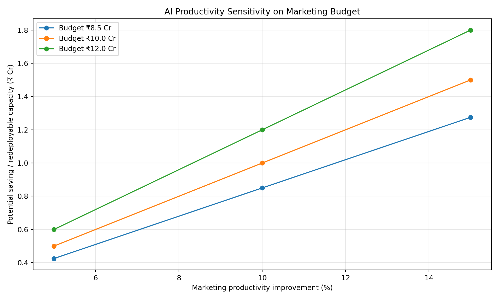

AI savings should be treated as redeployable capacity, not guaranteed profit. If AI reduces creative production or testing cost, the company can either spend less or test more. In an early marketplace, testing more is usually more valuable than cutting cost.

### 6.7 AI has four useful loops in a fashion marketplace

**Loop 1 — Creative production.** Myntra's technical paper on automated ad creative generation notes that homepage banners are a major customer touchpoint and revenue channel for ecommerce companies, that manual banner creation limits scale and personalization, and that experiments were performed on Myntra data. [S13]

**Loop 2 — Discovery.** Meesho's FY26 shareholder letter reports that its PRISM recommendation system processes large-scale behavioral and contextual signals, that **75%+ of orders** come from AI-driven personalized feeds, that PRISM improved conversion by about **15%**, and that it reduced time-to-traction for new product listings by about **27%**. [S4]

**Loop 3 — Support.** Meesho reports its AI customer-support system resolved **62% of consumer queries** without human intervention and reduced customer support costs by **23%** in FY26. [S4]

**Loop 4 — Operational leakage.** Meesho reports its TrustMesh model reduced return-to-origin by more than **10%**, and that its in-house ML stack runs at **60% to 70% lower inference and AI workload costs** than equivalent cloud services. [S4]

AI is not only a content tool. In ecommerce, it affects acquisition efficiency through discovery, conversion, support cost, fraud, returns, routing, and seller onboarding. Cheaper creatives alone do not fix CAC if the product experience still fails after delivery.

### 6.8 The acquisition stack should change by stage

| Stage | Primary task | Channel emphasis | What should be measured |
|---|---|---|---|
| **Months 1–2** | Test demand quality | Founder-led content, small creator cohorts, paid performance tests | Kept orders, first repeat, return rate, discount dependence |
| **Months 3–5** | Identify retained channels | Creator / affiliate, paid amplification of winners, category landing pages | Channel-level PVC-LTV, contribution after returns |
| **Months 6–8** | Build memory | CRM, recommendations, size confidence, wishlist reactivation, UGC | Repeat rate, reacquisition cost, cohort contribution |
| **Months 9–10** | Cut weak scale | Creator affiliates, CRM, selective paid, early seller-funded campaigns | New-customer share, paid CAC, contribution/order |

The sequence matters. Retail media cannot be the first engine because sellers do not pay much for weak traffic. CRM cannot work before the platform has customers to reactivate. Brand marketing should not scale before the customer promise is operationally reliable. Paid performance should not remain the main engine after repeat cohorts become visible.

### 6.9 The marketing strategy this implies

The strongest early model is not purely performance-led, influencer-led, founder-led, or brand-led. It is a layered system.

| Layer | Function |
|---|---|
| **Founder-led thesis** | Explains why this marketplace should exist |
| **Creator-led discovery** | Converts fashion browsing into social trust |
| **Paid amplification** | Scales only the creatives and cohorts that show retained contribution |
| **AI creative and catalogue system** | Increases testing speed and personalization |
| **CRM and repeat engine** | Converts first orders into lower-cost future demand |
| **Selective seller-funded promotion** | Begins monetizing traffic once intent is proven |

The purpose is not to make every channel cheap. The purpose is to make every acquired customer more likely to become cheaper to reactivate.

### 6.10 The mechanism

Marketing should not be treated as the front end of the marketplace. It is part of the marketplace engine.

The first version of marketing buys attention. The better version creates trust. The durable version creates memory.

A new fashion marketplace should use paid ads to test, creators to translate taste, founders to explain the market gap, AI to increase learning speed, and CRM to turn first orders into repeat behavior.

If this works, CAC falls because the system remembers the customer. If it does not, the company keeps paying the market to remember it. That is the difference between acquisition and compounding.

---

## 7. The Product Sets the CAC Ceiling

A marketplace does not acquire "a customer" in the abstract. It acquires a customer into a price point, a category, a brand promise, a return policy, and a delivery experience. CAC looks like a marketing number. The product decides how much CAC the business can actually carry.

A ₹799 order and a ₹1,999 order may come from the same ad account, the same creator, and the same app — but they leave different amounts of contribution behind after fulfilment, returns, discounts, payments, and support.

The fixed parts of cost do not fall proportionally with price. A payment failure, delivery attempt, customer support ticket, return pickup, warehouse touch, or exchange does not become three times cheaper because the product is cheap. Low AOV makes CAC less forgiving.

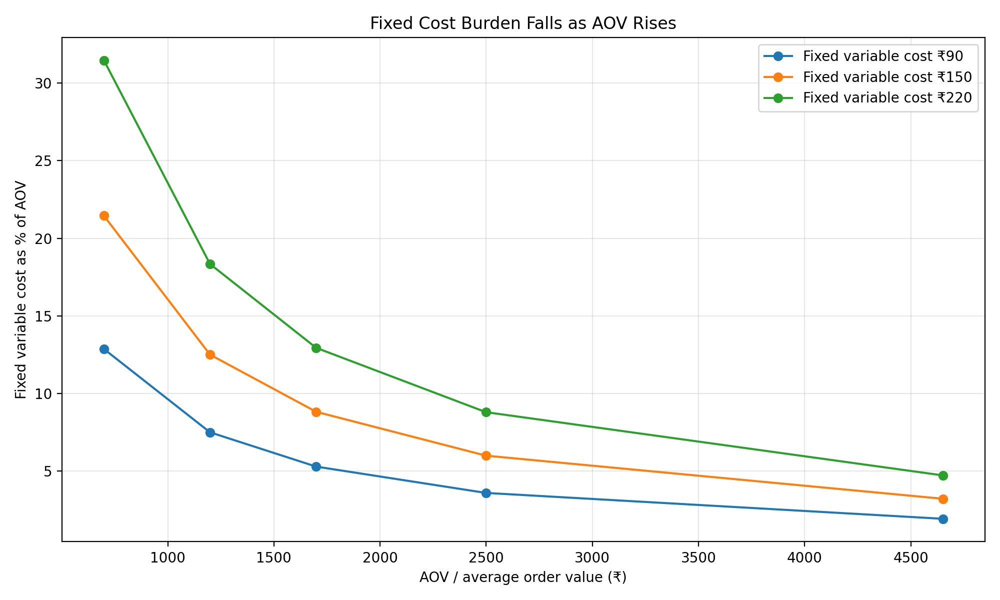

The graph uses internal cost cases, not reported logistics rates. The structure is what matters: if a fixed variable cost is ₹150, it consumes about **21%** of a ₹699 order, about **9%** of a ₹1,699 order, and about **3%** of a ₹4,652 order. The cost is identical in rupees, but not in economic weight.

### 7.1 The Indian price anchors

The Indian market gives three useful anchors.

Nykaa Fashion reported FY26 Fashion AOV of **₹4,652**, with **10.1 million Fashion orders** and **787 million Fashion visits**. Nykaa defines AOV as GMV generated across websites, apps, and stores divided by orders considered for such GMV. [S3]

Meesho gives a value-commerce anchor, not a premium fashion comp. In FY26: **2,668 million placed orders**, **₹41,560 crore NMV**. [S4] Meesho defines NMV as successfully delivered checkout value excluding cancelled, undelivered, returned orders, and checkout discounts; placed orders as unique products purchased per transaction. [S4] Dividing NMV by placed orders gives roughly **₹156 per placed item/order unit**, but this is not official AOV and should not be used as one.

The GST Council's 2025 rate material makes **₹2,500** a visible apparel and footwear boundary, listing apparel not exceeding ₹2,500 per piece and separately apparel exceeding ₹2,500 per piece, and footwear not exceeding ₹2,500 per pair and footwear exceeding ₹2,500 per pair. [S15]

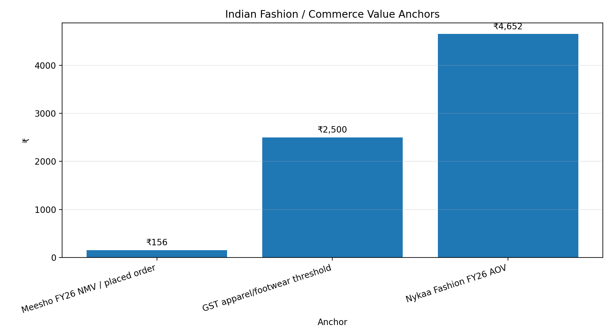

These anchors define the terrain, not the correct price for a new marketplace. India has a very low-price value-commerce market, a mid-price discretionary market, and a premium fashion market. Each has a different CAC ceiling.

### 7.2 AOV changes the acquisition ceiling

The CAC ceiling rises when the product generates more contribution per retained order. Higher AOV creates more contribution room, but also requires more trust, stronger brand credibility, better presentation, and lower perceived risk.

The model below uses contribution-rate assumptions of **8%**, **12%**, and **16%** per order. It assumes **3.5 contribution-bearing orders per customer**, a **12% present-value haircut**, and the **3x PVC-LTV/CAC hurdle**. These are internal model assumptions, not company-reported figures.

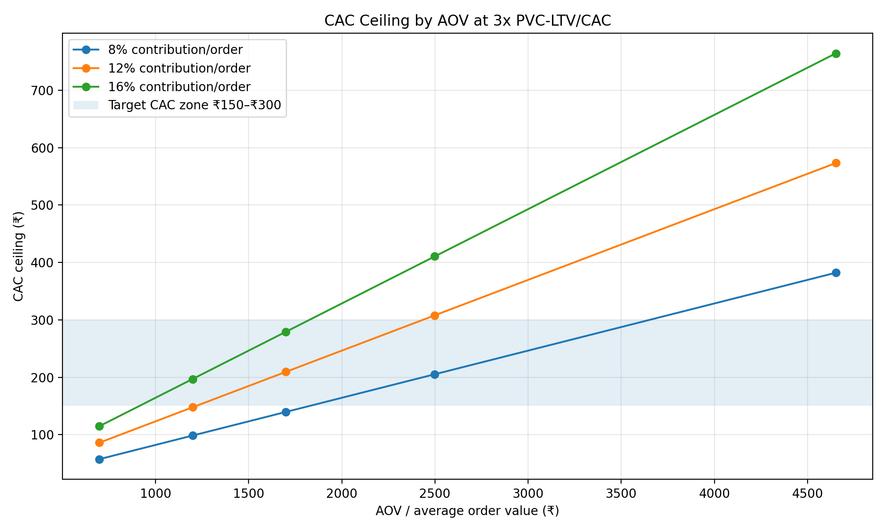

At low AOV, even a healthy contribution rate may not produce enough rupee contribution to support paid CAC. At higher AOV, the CAC ceiling rises, but conversion may become harder because the customer needs more confidence before buying.

This creates a middle zone for a new marketplace. A very low AOV strategy may convert easily but cannot tolerate much CAC. A very high AOV strategy may carry CAC better on paper but needs more trust than a new platform usually has. The working zone is likely controlled mid-market fashion — affordable enough to convert, valuable enough to leave contribution.

### 7.3 The ₹2,500 boundary is not just tax trivia

The ₹2,500 threshold sits near the psychological and economic edge of mass-premium fashion. Below it, many products still feel like reachable discretionary purchases. Above it, the customer typically expects stronger brand trust, better quality, better fit, and lower uncertainty.

A ₹699 product can be sold through impulse, trend, discount, or creator influence. A ₹2,999 product usually needs more evidence. The customer asks more questions: Will it fit? Is the fabric worth it? Can I return it easily? Is the brand reliable? Will it look the same after delivery?

Price is not only a revenue variable. Price changes the burden of proof.

### 7.4 Returns convert price into leakage

Fashion has a return problem because the product is evaluated twice — first on the screen, then on the body. The second evaluation is where many digital assumptions fail.

A peer-reviewed study on online apparel returns in India identified **34 return factors** and found that fit and size variation, defects, finding a better product, wrong delivery, lenient return policy, and value for money were crucial drivers of returns. [S16]

Myntra's footwear size recommendation paper states the same mechanism from an operational angle: in footwear, size and fit are critical, online shopping lacks try-on, and lack of good fit causes product returns, bad customer experience, and increased operational cost. [S18]

Return risk is not evenly distributed across categories:

| Category type | Return pressure | Why it matters |
|---|---|---|
| Fitted apparel | High | Size, body type, fabric fall, expectation mismatch |
| Footwear | High | Size variation across brands and comfort uncertainty |
| Occasion wear | Medium-high | Higher expectation, fit, color, material perception |
| Accessories | Lower | Less fit dependence, lower trial uncertainty |
| Beauty add-ons | Lower, but policy-sensitive | Often lower returnability, but trust and authenticity matter |
| Basics | Medium | Lower fashion risk, but high price sensitivity |

Category-level contribution should not be averaged too early. A marketplace can hide weak categories inside blended order growth. Category-level contribution is more useful than platform-level contribution in the first year.

### 7.5 The expected cost of returns rises quietly

Return cost behaves like an expected value. Even if a product is not returned, the category's return probability affects the economics of every placed order.

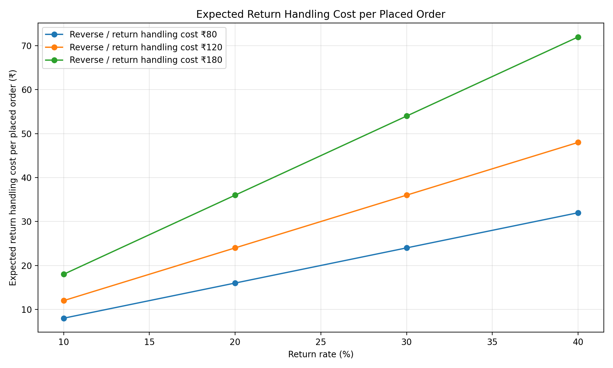

If return handling costs ₹120 and return rate is 30%, the expected return-handling burden is ₹36 per placed order. At a 40% return rate, it becomes ₹48. That looks small until compared against contribution. If contribution before CAC is only ₹100 per order, a ₹36 expected return burden is material. At ₹200, the same burden is easier to absorb.

Fit, product data, quality control, and return policy are not customer-experience extras. They are acquisition economics.

### 7.6 Brand type changes both CAC and contribution

| Brand type | CAC effect | Contribution effect | Main risk |
|---|---|---|---|
| Known national brands | Lower trust friction | Lower platform control, more price comparison | Customer may use marketplace only for discovery |
| Emerging D2C brands | Medium trust friction | Better margin potential | Quality and consistency vary |
| Creator-led drops | Lower cold-start CAC if audience trusts creator | Can generate urgency and social proof | Demand may be personality-dependent |
| Private label | Highest control over margin and pricing | Stronger contribution potential | Inventory and design risk move to platform |
| Value/unbranded supply | Price can convert fast | Thin contribution and higher quality risk | Returns and low loyalty |
| Accessories/add-ons | Lower fit risk | Useful for basket expansion | Lower standalone demand |

A completely open catalogue increases assortment but also increases quality variance, return risk, and discovery noise. A curated marketplace has fewer SKUs, but it can control the customer promise more tightly. In early stages, that control may be more valuable than assortment breadth.

### 7.7 Logistics is regressive at low AOV

A delivery cost, return pickup, or failed delivery is paid in rupees, not as a neat percentage of AOV. The DPIIT/NCAER logistics assessment estimated India's logistics cost at about **7.97% of GDP**. [S17] That source does not give a fashion-order delivery cost and should not be used that way. Its relevance is narrower: logistics is large and variable enough to be treated as a core economic layer, not a back-office detail.

Geographic expansion should follow contribution evidence. A city or pin code should not be opened because CAC is low there. It should be opened if delivery success, return rate, repeat purchase, and contribution per retained order are acceptable together.

### 7.8 The product strategy implied by the model

| Product band | Likely role | CAC implication |
|---|---|---|
| Below ₹799 | Traffic and value entry | CAC must be very low; contribution room is thin |
| ₹999–₹1,499 | Mass-fashion working zone | Good for creator-led and paid testing if returns are controlled |
| ₹1,500–₹2,499 | Stronger contribution zone | Better CAC tolerance, but requires stronger trust |
| Above ₹2,500 | Premium / brand-led zone | Can carry higher CAC only if brand and quality reduce hesitation |

The model points toward staged product architecture. In the first phase, the marketplace should use a narrow set of mid-price products to test demand without making CAC unrecoverable. In the second phase, add categories with lower return pressure to improve basket economics. In the third phase, add premium or owned supply only where trust and repeat behavior already exist.

Using low-price products to buy customers, then assuming those customers will naturally migrate upward, is a common mistake. It can happen. It should not be assumed. It has to be visible in cohort behavior.

### 7.9 The hidden mechanism

Price decides how much room exists after the order. Category decides how much of that room returns can take away. Brand type decides how much trust must be purchased. Logistics decides how much geography costs. Together, they decide the CAC ceiling.

Marketing cannot be separated from merchandising. A weak product mix makes CAC look expensive. A strong product mix makes the same CAC more recoverable.

The acquisition problem is not solved only in the ad account. It is solved in the product architecture. A new fashion marketplace should not ask only which channel can acquire customers cheaply. It should ask which products create customers worth acquiring.

---

## 8. The Model Has to Be Falsifiable

A marketplace model is useful only if it can be proven wrong. If every number can be explained away after the fact, the model is not analysis. It is narrative protection.

The earlier sections built the operating logic: CAC must fall, contribution must deepen, repeat share must rise, and product mix must support the acquisition cost. This section turns that logic into a measurement system.

The purpose is not to track more metrics. The purpose is to prevent the company from confusing activity with progress.

### 8.1 Gross orders are not the unit of truth

Placed orders are the easiest number to improve and the easiest to misread. A placed order can still become a cancellation, return, exchange, refund, failed delivery, or low-quality first transaction that never repeats.

The more useful unit is the **retained order** — an order that survived the operational system strongly enough to contribute to customer value.

At the target scale of **150,000 monthly placed orders**, return and cancellation assumptions change the actual retained base materially.

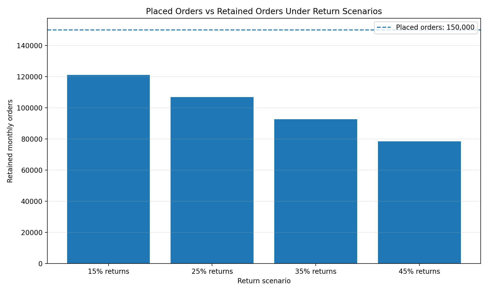

This model assumes a **5% cancellation/RTO layer** and return-rate cases of **15%, 25%, 35%, and 45%**. At a 35% return rate, 150,000 placed monthly orders become roughly **92,625 retained orders** after cancellation/RTO and returns. The headline order number stays the same; the economic base shrinks sharply.

A fashion marketplace should not report progress only as placed orders. It should separate: placed, shipped, delivered, retained, exchanged, returned, refunded, and contribution-bearing orders.

### 8.2 Attribution must survive incrementality

Advertising dashboards assign credit without proving causality. This is especially true for post-view conversion, where the user sees an ad and later converts without clicking.

Post-view conversion is useful in fashion because visual exposure can influence later purchase. It is also easy to over-credit. A customer who would have bought anyway may still be counted as a post-view conversion if the attribution window is broad enough.

The IAB/MRC retail media guidelines define incrementality as the causal impact of marketing isolated from other business factors, and recommend test-control approaches including randomized control trials, synthetic matching, and matched-market methods. [S11]

The model should measure three layers separately:

| Layer | What it asks |
|---|---|
| **Reported conversion** | Did the platform attribute the conversion to a campaign? |
| **Incremental conversion** | Would the conversion have happened without the campaign? |
| **Contribution-bearing conversion** | Did the customer keep the order and produce contribution? |

Only the third layer can support CAC recovery. A campaign that produces attributed conversions but not retained contribution is not solving acquisition. It is producing measurement noise.

### 8.3 The cohort has to pay back over time

CAC is paid before the customer proves repeat behavior. That makes cohort tracking the central validation tool.

The model below uses **₹140 contribution per order** and compares weak, base, and strong repeat curves over the first six months after acquisition. It compares the build-up of PVC-LTV against a **₹250 CAC** and a **3x hurdle of ₹750**.

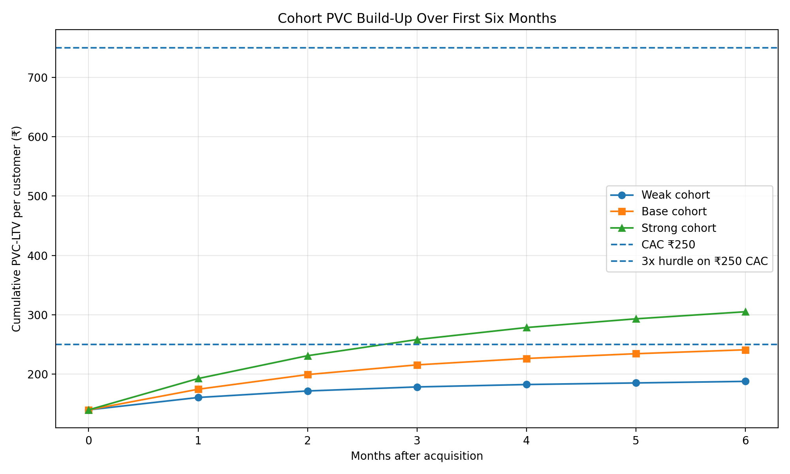

A weak cohort may recover part of CAC but fail to approach the required contribution value. A stronger cohort justifies the same CAC because customers keep buying. The question behind every acquisition decision is whether the cohort produces enough retained contribution before it decays.

| Channel view | Better cohort view |
|---|---|
| CAC by channel | CAC by retained customer |
| Orders by channel | Retained orders by channel |
| Revenue by channel | Contribution after returns by channel |
| ROAS by channel | PVC-LTV / CAC by channel |
| Conversion by channel | Incremental retained conversion by channel |

The channel that looks cheapest on Day 1 may be expensive by Month 3 if its customers do not repeat.

### 8.4 Discounts can hide inside CAC

A discount is often treated as a pricing action, not an acquisition cost. That separation makes CAC look cleaner than it is.

If the platform funds a discount to create a first order, that discount is part of acquisition economics. It reduces contribution in the same way media spend increases CAC.

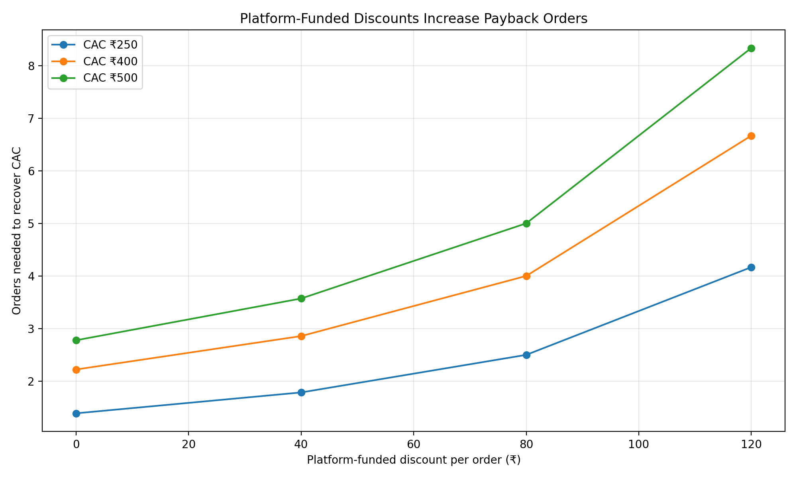

The model assumes a base contribution of **₹180 per order** before platform-funded discount. A ₹250 CAC with ₹180 contribution per order needs about **1.4 orders** to recover. If the platform funds ₹80 of discount per order, contribution falls to ₹100, and the same CAC needs **2.5 orders** to recover. The order still exists. The acquisition cost is just hidden inside contribution.

Discount reporting should be split:

| Discount type | Economic interpretation |
|---|---|
| **Brand-funded** | May not directly reduce platform contribution |
| **Seller-funded** | Can support conversion without platform bearing full cost |
| **Platform-funded** | Should be treated as acquisition or contribution leakage |
| **Customer-funded via wallet/referral liability** | Must be tracked as future cost, not free growth |

Without this split, a marketplace can show declining CAC while quietly increasing acquisition subsidy through discounts.

### 8.5 Category-level measurement is stricter than platform-level measurement

Blended metrics are useful for board slides, but weak for operating decisions. Fashion is not one category. Returns, contribution, fit risk, and repeat behavior vary by category and price point.

A platform-level CAC may look acceptable while one category destroys contribution. A platform-level return rate may hide a high-return subcategory. A platform-level repeat rate may be carried by low-margin products while higher-AOV categories fail to repeat.

The minimum useful measurement unit is:

$$\text{channel} \times \text{category} \times \text{price band} \times \text{city cohort}$$

A customer acquired through a creator for ₹1,499 western wear in Bengaluru is not economically identical to a customer acquired through paid search for ₹699 value footwear in a Tier-2 city. Treating them as the same customer creates false averages.

### 8.6 The operating scorecard

The model should be judged by whether these metrics move together:

| Metric | Weak signal | Base signal | Strong signal |
|---|---:|---:|---:|
| New-customer share of orders | 60%+ | ~35% | 25–30% |
| Paid CAC | ₹500+ | ~₹250 | ₹200 or lower |
| Return rate | 35–45% | 25–30% | Below 25% |
| Platform-funded discount/order | ₹100+ | ₹40–₹60 | Below ₹25 |
| Repeat / CRM / direct share | Below 40% | 60%+ | 70%+ |
| Contribution/order before CAC | Below ₹100 | ₹120–₹160 | ₹200+ |
| PVC-LTV / CAC | Below 2x | 3x | 4x+ |

No single metric proves health. A lower CAC is not enough if return rate rises. A higher repeat share is not enough if repeat orders are discount-funded. A higher contribution/order is not enough if volume comes from a small premium niche that cannot scale. A lower return rate is not enough if customers do not repeat. The scorecard is designed to make contradictions visible.

### 8.7 The six tests before scaling harder

| Test | What it checks | Failure mode |
|---|---|---|
| **Retained-order test** | Placed orders survive cancellation, returns, and refunds | Gross order growth overstates demand |
| **Incrementality test** | Campaigns create customers who would not have bought anyway | Attribution inflates performance |
| **Cohort payback test** | Customers recover CAC through retained contribution | First orders do not become customer value |
| **Discount dependency test** | Orders persist without platform-funded subsidy | CAC is hidden inside discounts |
| **Category contribution test** | Categories remain positive after returns and fulfilment | Blended margin hides weak categories |
| **City economics test** | Delivery, RTO, return, and repeat work by geography | Expansion increases order count but weakens contribution |

These tests do not slow growth. They prevent the company from scaling the wrong version of growth.

### 8.8 The hidden mechanism

The model fails when the company measures the wrong unit.

If it measures impressions, it may buy attention. If it measures orders, it may buy transactions. If it measures revenue, it may ignore cost-to-serve. If it measures CAC alone, it may acquire low-quality customers. If it measures contribution alone, it may underinvest in growth.

The useful unit is **retained customer contribution over time**.

That unit connects the full system: ad exposure, first order, delivery, returns, repeat purchase, contribution, and reacquisition cost. A marketplace becomes investable only when this unit improves as volume rises. If the unit weakens with scale, growth is revealing the problem, not solving it.

---

## 9. The First Engine Decides the Company

A new fashion marketplace cannot build every advantage at once. It does not begin with full marketplace liquidity, owned supply, repeat purchase, retail media, logistics density, and brand trust. Those are outcomes of a working system, not starting assets.

The practical question is narrower: which engine should the company build first?

Section 2 showed that Indian fashion companies operate through different engines. Myntra monetizes marketplace services, logistics, and advertising. Nykaa Fashion shows the pressure inside a curated fashion vertical. Meesho shows the power of repeat transaction frequency. Reliance and AJIO operate inside an omnichannel machine. Trent and Zudio use owned retail and price architecture. TMRW uses the brand-house path. None of these engines is free. Each one solves one bottleneck and creates another.

A new marketplace should not claim to be all of these at once. That would usually mean it has no real engine yet. The first engine has to reduce one of three pressures: CAC, contribution leakage, or repeat weakness. If it does not reduce at least one, it is only a positioning statement.

### 9.1 Three versions of the same marketplace

At the target scale of **150,000 monthly orders**, the same order count can describe three fundamentally different businesses:

| Metric | Weak system | Base system | Strong system |
|---|---:|---:|---:|
| Monthly orders | 150,000 | 150,000 | 150,000 |
| Contribution/order | ₹80 | ₹140 | ₹200 |
| New-customer share | 60% | 35% | 25% |
| Paid share of new customers | 70% | 40% | 35% |
| Paid CAC | ₹500 | ₹250 | ₹200 |
| PVC-LTV/customer | ₹600 | ₹850 | ₹1,200 |
| Return rate | 40% | 28% | 20% |
| Repeat / CRM / direct share | 40% | 65% | 75% |

The order count is identical. The system underneath is not.

The weak version is still replacing demand. High new-customer dependence, high CAC, high return pressure, and weak contribution depth. It may look like a growing marketplace from the outside. Internally, it is a campaign machine.

The base version has begun to develop memory. New-customer share has fallen, repeat and CRM orders carry more of the volume, and CAC has entered a range that customer value can support.

The strong version has more than acquisition efficiency. It has improved contribution, lower return pressure, and repeat behavior. That is where the marketplace starts to resemble an operating system rather than a sequence of campaigns.

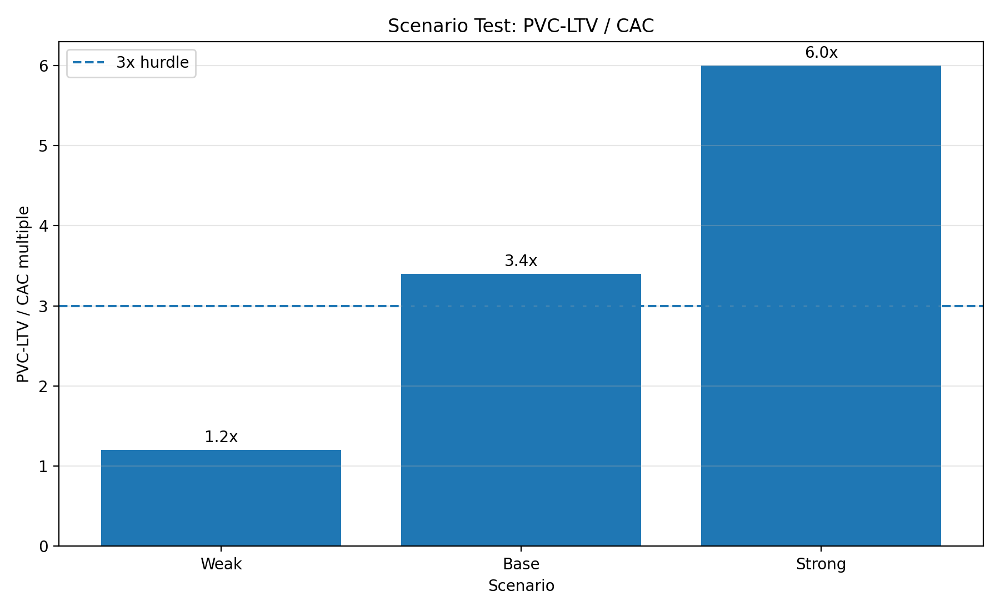

The ratio makes the difference visible. The weak system does not reach the 3x hurdle. The base system clears it. The strong system creates a wider margin of safety. This matters because early marketplace data is noisy — attribution can over-credit campaigns, returns can arrive late, discounts can hide inside contribution, and repeat behavior can decay. A narrow spread between CAC and customer value is not enough protection.

### 9.2 The same volume can create or consume capacity

Order volume only becomes useful when it leaves contribution after acquisition.

The weak system produces **₹1.2 Cr** of monthly contribution before paid CAC, but spends **₹3.15 Cr** on direct paid acquisition. It is negative before fixed costs.

The base system produces **₹2.1 Cr** of contribution before paid CAC and spends **₹0.53 Cr** on direct paid acquisition. It has operating room before fixed costs and broader marketing costs.

The strong system produces **₹3.0 Cr** of contribution before paid CAC and spends **₹0.26 Cr** on direct paid acquisition. It has substantially more room for operations, testing, errors, and reinvestment.

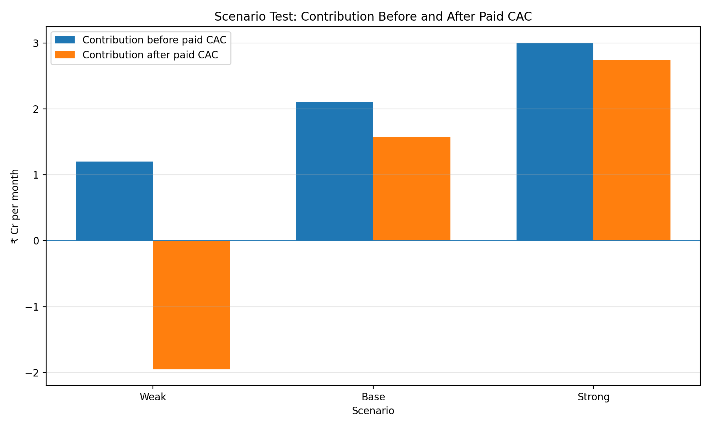

A marketplace does not become healthier because it processes more orders. It becomes healthier when those orders leave more contribution after the cost of acquiring or reactivating the customer. The weak system is not failing because it has no demand. It is failing because demand is too expensive relative to retained contribution.

### 9.3 The first strategic choice

Four plausible first engines exist for a new Indian fashion marketplace:

| First engine | What it tries to reduce | Main risk |
|---|---|---|
| **Creator-led demand** | Cold-start CAC and trust friction | Attribution noise and personality-dependent demand |
| **Curated mid-market supply** | Return risk and discovery noise | Slower assortment expansion |
| **Owned / exclusive supply** | Low contribution per order | Inventory, design, and working-capital risk |
| **Repeat and CRM system** | Reacquisition cost | Cannot work before enough first customers exist |

The most coherent starting point is a narrow system combining creator-led demand with curated mid-market supply.

This is not because creators are fashionable. Fashion discovery is partly social, visual, and trust-mediated. A cold paid ad must create attention and trust simultaneously. A creator can compress that trust gap — but only if the marketplace measures retained contribution rather than impressions.

Curated supply matters for the same reason. An open catalogue creates choice, but also creates inconsistency. In early-stage fashion, inconsistency becomes returns, support tickets, poor reviews, and weak repeat behavior. A smaller catalogue with better reliability can be economically superior to a larger catalogue that increases leakage.

The first engine should be designed to reduce CAC and leakage together.

### 9.4 The order mix is the evidence

The strongest evidence that the marketplace is improving is not a press number. It is the changing composition of orders.

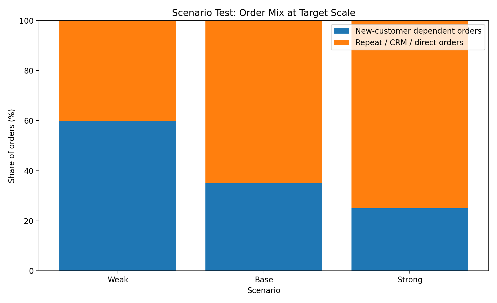

In the weak system, **60%** of orders still depend on new customers. In the base system, new-customer dependence falls to **35%**. In the strong system, it falls to **25%**.

Repeat share should be treated as an economic metric, not a retention metric. Repeat orders spread CAC across more transactions. They also give the platform more behavioral data, better recommendations, higher CRM leverage, and more credible seller monetization. A marketplace that cannot reduce new-customer dependence is not compounding. It is replacing.

### 9.5 Returns decide whether contribution is real

Contribution is fragile in fashion because returns convert apparent revenue into operational cost. The weak scenario combines low contribution per order with high return pressure. The strong scenario combines higher contribution depth with lower return pressure.

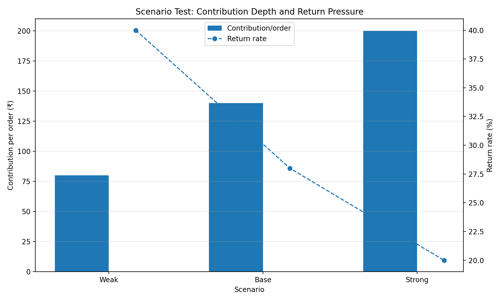

High returns reduce retained order value, add reverse logistics cost, increase support burden, and weaken customer trust. They also corrupt acquisition analysis — a channel may appear to produce orders while actually producing poor retained contribution.

Product strategy and marketing strategy cannot be separated. A channel that acquires customers into high-return categories may look efficient at the top of the funnel and weak after fulfilment.

The correct unit is not acquired customer. It is acquired retained customer with repeat probability.

### 9.6 What the company should not do first

| Move | Why it is dangerous |
|---|---|
| Launching as a broad open marketplace | Increases assortment but weakens control over quality, returns, and discovery |
| Scaling paid performance before cohort proof | Buys demand before knowing whether the customer repays CAC |
| Using discounts as the main acquisition tool | Hides CAC inside contribution leakage |
| Expanding geographically before logistics evidence | Creates orders in zones that may not support retained contribution |
| Assuming retail media too early | Sellers pay for traffic only when the platform proves intent and conversion |

Each of these moves can increase order volume. That is why they are tempting. But each can weaken the system while making the surface metric look better. The early-stage discipline is to reject volume that does not improve the customer-value equation.

### 9.7 What the company should build first

The operating thesis is narrow.

Begin with a controlled product architecture, not maximum assortment — mid-market price bands where contribution can support acquisition without requiring trust the platform has not yet built. Use creators as trust infrastructure, not media inventory. A creator who produces retained buyers is useful. A creator who produces impressions without kept orders is not.

Use paid performance as a testing tool. Paid campaigns should amplify proven products, proven creator formats, and proven cohorts — not become the default source of every order.

Build CRM and repeat loops early, even before they matter at scale. Saved sizes, wishlists, return reliability, category preferences, and app habit are not secondary features. They are the infrastructure through which CAC becomes recoverable.

Delay retail media monetization until traffic is strong enough to deserve seller money. Advertising revenue is a powerful layer in mature marketplaces, but premature ad monetization can degrade trust if the marketplace pushes paid visibility before relevance.

### 9.8 The minimum viable engine

The first viable engine is not simply "fashion marketplace."

| Layer | Function |
|---|---|
| Curated mid-market supply | Controls return risk and improves contribution consistency |
| Creator-led discovery | Reduces cold-start trust friction |
| Paid amplification | Scales only validated cohorts |
| CRM and repeat system | Converts first orders into lower-cost future orders |
| Category-level contribution tracking | Prevents blended metrics from hiding weak segments |
| Selective logistics expansion | Avoids growing into geographies that weaken contribution |

This engine does not guarantee success. It only creates a structure where success can be measured honestly.

The company should not be judged by whether it can reach the order target once. It should be judged by whether reaching that target makes the next set of orders cheaper, cleaner, and more contribution-bearing.

### 9.9 The hidden mechanism

A marketplace begins by paying the market to try it. That is unavoidable.

The question is whether the market remembers.

Memory appears when customers return, when sellers see reliable demand, when creators can convert without heavy subsidy, when CRM becomes cheaper than reacquisition, when returns decline through better fit and product data, and when traffic becomes valuable enough for sellers to pay for visibility.

If memory does not form, the marketplace remains a paid acquisition surface.

If memory forms, CAC changes character. It stops being the cost of buying an order and becomes the cost of adding a customer to a system that can use them again.

That is the strategic test. The first engine must turn acquired attention into marketplace memory.

---

## 10. Conclusion: The Marketplace Is Real Only When It Remembers

A new Indian fashion marketplace can reach the target order scale. That is not the central uncertainty. The central uncertainty is whether reaching that scale reduces future dependence on paid acquisition.

The difference is structural. A company can buy transactions through discounts, creators, performance ads, sale events, and free delivery. It cannot buy marketplace memory directly. Memory has to be produced by a working system: reliable products, manageable returns, repeat purchase, fit confidence, CRM response, creator trust, and enough traffic quality for sellers to eventually pay for visibility.

The model points to three core truths:

1. **CAC is recoverable only through retained contribution.** A low CAC is not enough if the order is returned, the customer does not repeat, or the next order requires another subsidy. The relevant unit is retained customer contribution over time.

2. **The first engine matters more than the first scale target.** A new marketplace should not begin by trying to look like Myntra. It should begin by choosing the first bottleneck it can realistically reduce: cold-start trust, return leakage, contribution depth, or reacquisition cost.

3. **Growth is healthy only when dependence falls.** If orders rise while paid dependence remains high, the company is scaling the same problem. If orders rise while CAC falls, repeat share rises, and contribution deepens, the marketplace is beginning to compound.

The strongest early path is not a generic marketplace. It is a controlled system: curated mid-market supply, creator-led discovery, paid amplification of validated cohorts, AI-assisted creative and discovery operations, CRM and repeat loops, and category-level contribution tracking.

The weaker path is also clear: broad catalogue, discount-led first orders, premature geographic expansion, paid performance before cohort proof, and early retail-media assumptions before traffic quality exists.

**Final recommendation:** Treat the first 150,000 monthly orders as an experiment in dependency reduction. If the company reaches that volume with paid CAC near ₹250, new-customer share near 35% or lower, repeat/CRM/direct share above 60%, contribution/order above ₹120, and PVC-LTV/CAC near or above 3x — the marketplace has produced its first layer of memory. If not, the order target has been reached without solving the underlying system.

The marketplace that matters is not the one that gets the first order.

It is the one where the second order costs less to create.

---

## Appendix: Visual Assets

| Section | Visual | File |
|---|---|---|
| Section 2 | Myntra FY25 Revenue Layers | `./fashion-marketplace-cac/assets/section2_myntra_revenue_layers.png` |
| Section 2 | Nykaa Fashion FY26 Economic Stack | `./fashion-marketplace-cac/assets/section2_nykaa_fashion_economic_stack.png` |
| Section 2 | Meesho FY26 Frequency and NMV Loop | `./fashion-marketplace-cac/assets/section2_meesho_frequency_nmv_loop.png` |
| Section 2 | Indian Marketplace Advertising Layer | `./fashion-marketplace-cac/assets/section2_indian_marketplace_ad_layer.png` |
| Section 3 | Marketing and Growth Spend Intensity | `./fashion-marketplace-cac/assets/section3_marketing_growth_spend_intensity.png` |
| Section 3 | Monthly CAC Burden | `./fashion-marketplace-cac/assets/section3_monthly_cac_burden_5000_orders.png` |
| Section 3 | Incremental CAC vs Post-View Conversion | `./fashion-marketplace-cac/assets/section3_incremental_cac_vs_post_view_conversion.png` |
| Section 4 | Required Contribution Value by CAC | `./fashion-marketplace-cac/assets/section4_required_pvc_ltv_by_cac.png` |
| Section 4 | Orders Needed to Recover CAC | `./fashion-marketplace-cac/assets/section4_orders_needed_to_recover_cac.png` |
| Section 4 | PVC-LTV by Contribution and Repeat Depth | `./fashion-marketplace-cac/assets/section4_pvc_ltv_by_contribution_and_repeat_depth.png` |
| Section 4 | CAC Ceiling at 3x PVC-LTV/CAC | `./fashion-marketplace-cac/assets/section4_cac_ceiling_at_3x_pvc_ltv.png` |
| Section 5 | Ramp Variants to 150,000 Monthly Orders | `./fashion-marketplace-cac/assets/section5_ramp_variants_150k_monthly_orders.png` |
| Section 5 | Base Path Orders vs CAC | `./fashion-marketplace-cac/assets/section5_base_path_orders_vs_cac.png` |
| Section 5 | Base Path Monthly Paid Acquisition Spend | `./fashion-marketplace-cac/assets/section5_base_path_paid_acquisition_spend.png` |
| Section 5 | Target Order Mix Shift | `./fashion-marketplace-cac/assets/section5_target_order_mix_shift.png` |
| Section 5 | Contribution After Paid CAC | `./fashion-marketplace-cac/assets/section5_contribution_after_paid_cac.png` |
| Section 6 | Acquisition Channels CAC Range and Memory Potential | `./fashion-marketplace-cac/assets/section6_channel_cac_range_memory_potential.png` |
| Section 6 | AI Productivity Marketing Budget Sensitivity | `./fashion-marketplace-cac/assets/section6_ai_productivity_marketing_budget_sensitivity.png` |
| Section 7 | Fixed Cost Burden by AOV | `./fashion-marketplace-cac/assets/section7_fixed_cost_burden_by_aov.png` |
| Section 7 | Indian Value Anchors | `./fashion-marketplace-cac/assets/section7_indian_value_anchors.png` |
| Section 7 | CAC Ceiling by AOV | `./fashion-marketplace-cac/assets/section7_cac_ceiling_by_aov.png` |
| Section 7 | Expected Return Handling Cost | `./fashion-marketplace-cac/assets/section7_expected_return_handling_cost.png` |
| Section 8 | Retained Orders Under Return Scenarios | `./fashion-marketplace-cac/assets/section8_retained_orders_return_scenarios.png` |
| Section 8 | Cohort PVC Build-Up | `./fashion-marketplace-cac/assets/section8_cohort_pvc_build_up.png` |
| Section 8 | Discount Dependency Payback Orders | `./fashion-marketplace-cac/assets/section8_discount_dependency_payback_orders.png` |
| Section 9 | Scenario PVC-LTV / CAC | `./fashion-marketplace-cac/assets/section9_scenario_pvc_ltv_cac.png` |
| Section 9 | Contribution Before and After Paid CAC | `./fashion-marketplace-cac/assets/section9_contribution_before_after_paid_cac.png` |
| Section 9 | Order Mix Scenarios | `./fashion-marketplace-cac/assets/section9_order_mix_scenarios.png` |
| Section 9 | Contribution Depth and Return Pressure | `./fashion-marketplace-cac/assets/section9_contribution_depth_return_pressure.png` |

## Appendix: Source Quality Notes

S2, S5, and S6 are financial-statement PDFs hosted by MediaNama rather than MCA or the companies themselves. They are usable working copies of filings. For final publication, replace them with MCA-hosted or company-hosted filing links if available.

S11 is not India-specific, but it is relevant for the definitions of viewability, attribution, and incrementality.

S12 is not India-specific. It supports only the general AI productivity range and should not be used as proof of Indian media-cost reduction.

S13 and S18 are arXiv papers. They are useful technical research sources using Myntra context, but they are not peer-reviewed journal publications.

S14 is marketing-industry reporting of company claims. It should be used as directional evidence about Myntra's creator-commerce positioning, not as audited financial data.
